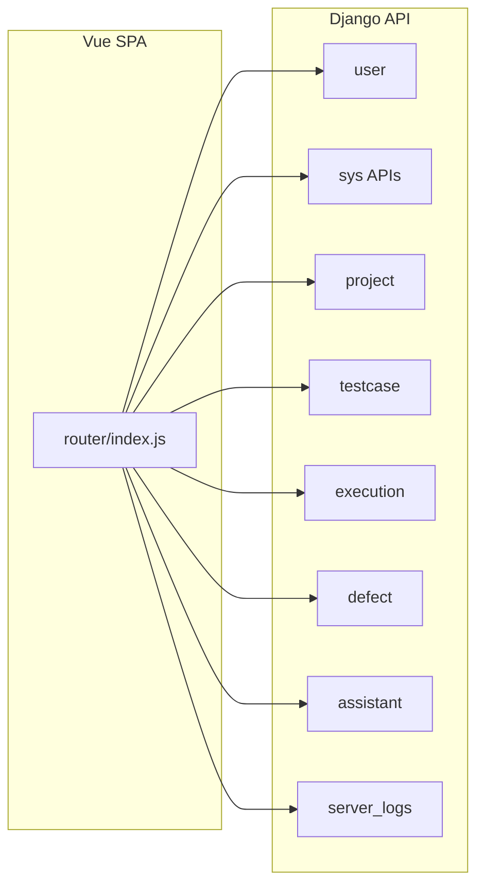

# 项目架构与当前功能清单

本文档基于仓库内 Django REST + Vue 的代码与路由扫描结果，归纳技术栈、模块划分，以及前后端已暴露的主要业务能力。

## 技术栈与整体形态

- **后端**: Django 4.2 + Django REST Framework，默认 **Token 认证**，MySQL 为主库；可选 **Redis**（缓存/验证码、Channels）；**Channels**（ASGI）；**Celery** 与 **django-apscheduler** 在配置中用于异步/定时（执行引擎相关）。
- **前端**: Vue 3 + Vue Router（[frontend/src/router/index.js](../frontend/src/router/index.js)），主布局 `MainLayout`，部分性能页独立布局。
- **API 入口**: 根路由 [AITestProduct/urls.py](../AITestProduct/urls.py) 将 `/api/*` 分发给各应用。

---

## 后端应用模块（INSTALLED_APPS 与职责）

| 应用 | 主要职责 |
|------|-----------|
| [user](../user/) | 账号体系、组织/角色、站内消息、敏感信息变更审批、用户侧审计事件 |
| [project](../project/) | 测试项目、测试任务、发布计划（releases） |
| [testcase](../testcase/) | 用例/模块/环境/变量、测试方法、用例步骤、测试设计；API 规格导入与 AI 辅助填数 |
| [execution](../execution/) | 测试计划与报告、性能任务与调度、K6 会话、API 场景编排与运行、仪表盘与质量看板数据 |
| [defect](../defect/) | 缺陷管理；从执行结果创建缺陷 |
| [assistant](../assistant/) | 知识库（文章/文档/检索/分块预览）、LLM 连通性；独立 [ai_urls](../assistant/ai_urls.py) 提供用例生成/修复类 AI 接口 |
| [common](../common/) | 公共模型/服务（如审计），供其他应用复用，**无单独根 URL 前缀** |
| [server_logs](../server_logs/) | 远程日志主机、日志分析/检索/趋势、自动工单队列与转缺陷 |

---

## API 功能一览（按根路径前缀）

### `/api/user/` — [user/urls.py](../user/urls.py)

- 验证码、注册、登录、当前用户 `me`、个人资料、改密。
- **敏感字段变更**：用户发起、待审状态查询；管理员列表与决策；另挂载 [`/api/change-requests/`](../user/approval_urls.py) 的 approve/reject。
- 站内系统消息列表与已读标记。
- **ViewSet**：用户、组织、消息设置、角色等的 CRUD（DRF DefaultRouter）。
- 用户个人 **审计事件** 列表：`me/audit/events/`。

### `/api/sys/` — [user/sys_urls.py](../user/sys_urls.py)（偏系统管理员）

- **AI 模型配置**：查询/断开/重连。
- **AI 使用统计**：事件列表、汇总、指标、Top 错误、延迟趋势、CSV 导出。
- **全站审计**：事件列表、CSV 导出。

### `/api/project/` — [project/urls.py](../project/urls.py)

- 项目（projects）、测试任务（tasks）、发布计划（releases）的 REST 资源。

### `/api/testcase/` — [testcase/urls.py](../testcase/urls.py)

- **ViewSet**：用例、模块、环境、环境变量、测试方法、用例步骤、测试设计。
- **工具型接口**：`ai-fill-test-data/`、`suggest-extractions/`、`import-api-spec/`（Swagger/cURL 等导入）。

### `/api/environments/` — [testcase/environment_urls.py](../testcase/environment_urls.py)

- 与 testcase 中环境 ViewSet 重复的挂载入口（便于前端按「环境」域名组织）。

### `/api/execution/` — [execution/urls.py](../execution/urls.py)

- **ViewSet**：测试计划（plans）、测试报告（reports）、性能任务（tasks）、定时任务与日志、K6 会话、API 场景/步骤/运行/步骤运行。
- **仪表盘**：`dashboard/stream/`（流式）、`dashboard/summary/`、`dashboard/quality/`（质量数据）。

### `/api/perf/` — [execution/perf_urls.py](../execution/perf_urls.py)

- 性能任务与 K6 会话的 **第二套路由**（与 execution 中部分资源对应，basename 区分）。

### `/api/defect/` — [defect/urls.py](../defect/urls.py)

- 缺陷 CRUD（defects）。
- `defects/from-execution/`：从执行记录生成缺陷。

### `/api/assistant/` — [assistant/urls.py](../assistant/urls.py)

- 知识文章 CRUD；知识检索、分类、文本抽取、文件自动填充。
- 知识文档：上传、入库、状态、分块预览、重试、删除。
- LLM 测试连接；运行时状态等。

### `/api/ai/` — [assistant/ai_urls.py](../assistant/ai_urls.py)

- AI 连接校验、阶段一预览、**生成用例**（含流式）、**建议用例修复**。

### `/api/server-logs/` — [server_logs/urls.py](../server_logs/urls.py)

- 远程日志主机、服务端日志相关审计事件。
- 日志分析（含上下文）、历史检索、错误趋势、组织选项。
- **自动工单**：入队、任务详情、一键创建缺陷。

### `/admin/`

- Django 管理后台。

---

## 前端页面功能（与路由对应）

来源：[frontend/src/router/index.js](../frontend/src/router/index.js)。

- **认证**: 登录、注册（公开路由）。
- **总览**: Dashboard、质量看板 `quality-dashboard`。
- **用户中心**: `user/center`。
- **项目管理**: `projects`。
- **测试资产**: 测试方法 `test-approach`、测试设计（列表+详情）、测试计划（列表+详情）、功能/API 等用例类型 `test-case/:type`、专用 API 用例页 `test-case/api`、测试报告（列表+详情）。
- **性能**: 负载监控、性能环境管理、性能任务管理、定时任务列表/详情/日志、K6 会话列表（部分路由在 MainLayout 外）。
- **缺陷与发布**: 缺陷列表/看板/详情、发布计划与详情。
- **AI**: AI 助手页。
- **运维**: 服务器日志页（带 keepAlive）。
- **系统**（含路由守卫：非系统管理员不可访问 org/role/user/messages/ai-usage/audit 等前缀）: 消息设置/管理、组织/角色/用户管理、AI 用量看板、审计事件；知识中心、帮助中心。

---

## 小结：你「目前都有」的核心业务能力（一句话归纳）

这是一个 **测试管理平台**：覆盖 **项目与发布计划**、**测试设计/计划/用例（含 API 与导入）**、**环境与变量**、**执行与报告**、**性能测试（任务/调度/K6）**、**API 场景编排运行**、**缺陷与从执行建单**、**AI 辅助（生成用例/修复建议/填数）**、**知识库与 RAG 相关能力**、**远程日志分析与自动转缺陷**，并配备 **组织角色权限、站内消息、敏感变更审批、审计与 AI 用量治理** 等企业级周边能力。
