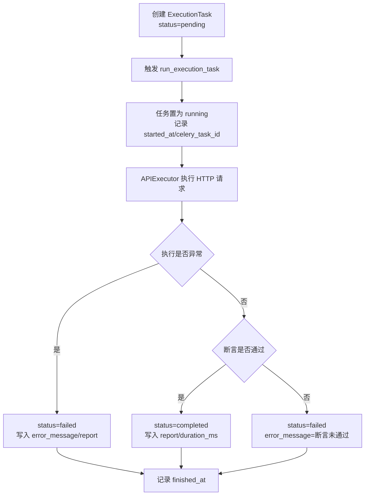

# 13-API测试执行引擎开发文档

## 0. 需求来源与开发动因

- 业务价值摘要：构建异步可观测执行底座，支撑规模化API测试执行。
- 业务背景：API 用例执行需要从“人工/同步脚本”升级为平台化、异步化能力。
- 现状痛点：执行过程缺少统一状态机、耗时统计和结构化报告，难以支撑批量任务与问题定位。
- 建设目标：建设 `requests + Celery` 执行引擎，统一任务执行链路。
- 预期收益：获得可扩展、可观测、可重试的执行基础设施，提升执行效率与诊断能力。

## 1. 功能概述

本次实现为 `execution/` 模块补充 API 测试执行引擎核心能力，支持：

- 基于 `requests` 发起 HTTP 请求执行；
- 基于 `Celery` 异步执行任务；
- 任务状态流转（`Pending -> Running -> Completed/Failed`）；
- 基础断言（状态码断言、响应体包含断言）；
- 记录执行耗时与结构化 JSON 报告。

---

## 2. 逻辑流程图（Mermaid）

请在文档中使用 Mermaid 语法画出该逻辑的时序图或流程图。



---

## 3. 状态机转换说明

执行引擎状态机遵循以下单向转换：

1. `pending`：任务创建后初始状态，尚未被 worker 消费；
2. `running`：`run_execution_task` 启动后立即进入运行态，写入开始时间；
3. `completed`：请求成功且断言全部通过；
4. `failed`：请求异常或断言失败。

关键约束：

- `pending -> running` 由 Celery 任务启动时触发；
- `running -> completed` 由执行器返回 `passed=true` 触发；
- `running -> failed` 覆盖两类失败：执行异常、断言失败；
- `finished_at` 仅在终态（`completed/failed`）写入。

---

## 4. 核心 API 接口说明

本次核心逻辑 API（服务内）如下：

### 4.1 `APIExecutor.execute(task: ExecutionTask) -> dict`

- **职责**：执行 HTTP 请求并产出标准化报告；
- **输入**：`ExecutionTask` 模型实例；
- **输出**：
  - `passed`: 是否通过；
  - `duration_ms`: 执行耗时；
  - `request`: 请求快照；
  - `response`: 响应快照；
  - `assertions`: 断言明细（`status_code`、`body_contains`）。

### 4.2 `run_execution_task(execution_task_id: int) -> dict`

- **职责**：Celery 异步任务入口；
- **行为**：
  - 将任务状态切到 `running`；
  - 调用 `APIExecutor` 执行；
  - 回写 `report/duration_ms/finished_at/error_message`；
  - 根据结果切换为 `completed` 或 `failed`。

---

## 5. 数据库变更点

新增模型：`ExecutionTask`（表名：`execution_task`）。

新增字段（核心）：

- 请求信息：`method`、`url`、`headers`、`body`、`timeout_seconds`
- 断言配置：`expected_status`、`expected_body_contains`
- 执行状态：`status`（`pending/running/completed/failed`）
- 执行过程：`started_at`、`finished_at`、`duration_ms`
- 异步追踪：`celery_task_id`
- 结果输出：`error_message`、`report(JSON)`

迁移文件：`execution/migrations/0008_executiontask.py`。

---

## 6. ExecutionTask JSON 报告结构示例

```json
{
  "passed": true,
  "duration_ms": 126,
  "request": {
    "method": "POST",
    "url": "https://api.example.com/v1/login",
    "headers": {
      "Content-Type": "application/json"
    },
    "body": {
      "username": "demo",
      "password": "******"
    },
    "timeout_seconds": 30
  },
  "response": {
    "status_code": 200,
    "headers": {
      "Content-Type": "application/json"
    },
    "body_text": "{\"code\":0,\"msg\":\"ok\"}"
  },
  "assertions": {
    "status_code": {
      "passed": true,
      "detail": "实际 200，期望 200"
    },
    "body_contains": {
      "passed": true,
      "detail": "响应体包含预期片段"
    }
  }
}
```

---

## 7. 安装/配置依赖

### 7.1 依赖安装

```bash
pip install -r requirements.txt
```

新增依赖：

- `celery>=5.4`
- `requests>=2.31.0`（项目已存在）

### 7.2 Celery 配置项

`AITestProduct/settings.py` 新增：

- `CELERY_BROKER_URL`（默认：`redis://127.0.0.1:6379/1`）
- `CELERY_RESULT_BACKEND`
- `CELERY_TASK_SERIALIZER`
- `CELERY_ACCEPT_CONTENT`
- `CELERY_RESULT_SERIALIZER`
- `CELERY_TIMEZONE`
- `CELERY_TASK_ACKS_LATE`
- `CELERY_WORKER_PREFETCH_MULTIPLIER`

### 7.3 启动方式（示例）

```bash
# Django 服务
python manage.py runserver

# Celery Worker（Windows 可改为 solo 池）
celery -A AITestProduct worker -l info -P solo
```

---

## 8. 优化项（稳定性与安全）

### 8.1 重试与超时

- `run_execution_task` 增加 `autoretry_for` 自动重试；
- 启用指数退避与抖动（`retry_backoff/retry_jitter`）；
- 增加 `soft_time_limit/time_limit`，避免 worker 长时间阻塞。

### 8.2 幂等与并发保护

- 使用缓存锁（`execution_task_lock:{id}`）防止并发重复执行；
- 任务进入运行态前使用事务 + 行级锁二次确认状态。

### 8.3 连接复用与日志治理

- `APIExecutor` 使用 `requests.Session` 复用连接；
- 对响应体进行截断，避免超大报文写库；
- 对敏感头/字段（如 `Authorization`、`token`、`password`）进行脱敏后写入报告。

### 8.4 可观测性

- 执行报告增加 `trace_id`，用于串联任务日志与问题排查。
