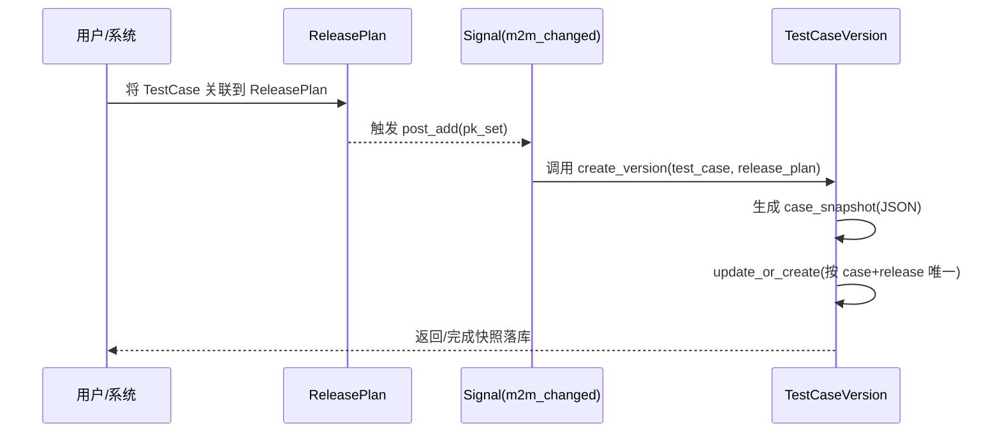

# 14-测试资产版本快照开发文档

## 0. 需求来源与开发动因

- 业务价值摘要：沉淀发布时测试基线，实现测试资产可追溯与可回滚。
- 业务背景：发布版本需要绑定“当时的测试资产状态”，支持审计追溯与版本复盘。
- 现状痛点：用例持续修改导致历史状态丢失，线上问题出现时难以还原发布当时的测试基线。
- 建设目标：引入多版本快照与回滚能力，冻结关键发布节点的测试资产状态。
- 预期收益：确保测试资产在发布维度可追踪、可恢复，提升问题复盘效率。

## 1. 功能概述

为 SmartTest 平台新增“测试用例版本快照”能力：当测试用例被关联到某个 `ReleasePlan` 时，系统自动记录该用例在当时的完整状态，形成可追溯的版本快照，支持后续审计与回溯恢复。

---

## 2. 设计思路

核心目标是把“发布版本”与“测试资产状态”绑定：

- 发布计划是业务上的时间节点；
- 用例会持续演进，直接读取当前用例无法还原历史状态；
- 快照模型 `TestCaseVersion` 负责存储“某用例在某发布计划下”的冻结数据。

实现要点：

1. 在 `ReleasePlan` 上增加 `test_cases` 关联，显式表达“某版本包含哪些用例”；
2. 在 `testcase/models.py` 新增 `TestCaseVersion`；
3. 在 `TestCaseVersion.create_version` 中统一生成并落库快照；
4. 通过 `m2m_changed` 信号监听 `ReleasePlan.test_cases` 的 `post_add`，自动触发快照。

---

## 3. 逻辑流程图（Mermaid）

请在文档中使用 Mermaid 语法画出该逻辑的时序图或流程图。



---

## 4. 核心 API / 方法说明

### 4.1 `TestCase.build_snapshot_payload()`

- **职责**：从当前 `TestCase` 及其子类型扩展表、步骤表聚合完整快照；
- **输出**：结构化 JSON（见下文 `case_snapshot` 结构定义）。

### 4.2 `TestCaseVersion.create_version(test_case, release_plan, creator=None)`

- **职责**：生成版本标签并保存快照；
- **策略**：按发布计划下递增 `snapshot_no` 生成多版本快照，不覆盖历史；
- **产物**：`TestCaseVersion` 记录。

### 4.3 `release_plan_case_snapshot`（Signal）

- **触发时机**：`ReleasePlan.test_cases` 的 `post_add`；
- **行为**：遍历新增 case，逐条创建/更新版本快照。

---

## 5. 通过快照实现“版本回溯”

版本回溯可按以下步骤实现：

1. 选择目标 `ReleasePlan` 与 `TestCase`；
2. 查询 `TestCaseVersion` 得到历史 `case_snapshot`；
3. 从 `case_snapshot.base/subtype/steps` 回填到当前用例；
4. 保存当前用例并可再生成一条新快照，形成“回滚操作可追踪”的闭环。

建议实践：

- 回溯前先对“当前态”再做一次快照，避免覆盖后无法恢复；
- 回溯操作单独记录审计日志（操作者、时间、来源版本）。

---

## 6. `case_snapshot` 字段结构定义

`case_snapshot` 为 JSONField，结构如下：

```json
{
  "schema_version": "1.0",
  "base": {
    "id": 1001,
    "module_id": 21,
    "case_name": "登录接口-正确账号密码",
    "case_number": 88,
    "test_type": "api",
    "level": "P1",
    "is_valid": true,
    "exec_count": 12,
    "review_status": 3,
    "archive_status": 1,
    "is_deleted": false
  },
  "subtype": {
    "api_url": "https://api.example.com/login",
    "api_method": "POST",
    "api_headers": {
      "Content-Type": "application/json"
    },
    "api_body": {
      "username": "demo",
      "password": "******"
    },
    "api_expected_status": 200
  },
  "steps": [
    {
      "id": 9001,
      "step_number": 1,
      "step_desc": "发送登录请求",
      "expected_result": "返回 token"
    }
  ]
}
```

字段说明：

- `base`：`TestCase` 主表核心字段；
- `subtype`：按 `test_type` 存储子表字段（API/性能/安全/UI 自动化）；
- `steps`：步骤快照列表，保留执行语义；
- `schema_version`：快照结构版本号，便于后续兼容升级。

---

## 7. 数据库变更点

- 新增 `ReleasePlan.test_cases` 多对多关联（`project` 应用迁移）；
- 新增 `TestCaseVersion` 表（`testcase` 应用迁移）：
  - `test_case` / `release_plan`
  - `snapshot_no`（发布计划内快照序号）
  - `version_label`
  - `case_snapshot(JSON)`
  - `source_version`（可选，记录回溯来源）
  - 新增组合索引：`test_case + release_plan + snapshot_no`

---

## 8. 安装/配置依赖

本功能基于 Django ORM 与 Signal，不引入新增三方依赖。执行迁移即可启用：

```bash
python manage.py migrate
```

---

## 9. 版本回溯接口

- **URL**：`POST /api/testcase/cases/{id}/rollback-version/`
- **入参**：
  - `version_id`：目标快照 ID
- **行为**：
  1. 先为当前态创建一条基线快照（防止回滚后无法恢复）；
  2. 使用目标 `case_snapshot` 回填主字段、子类型字段和步骤；
  3. 返回 `rollback_to_version_id` 与 `baseline_version_id`。

---

## 10. 快照策略优化说明

- 由“单版本覆盖”升级为“多版本留存”，完整保留历史；
- 通过 `snapshot_no` + `version_label` 明确时间序列；
- 保留 `schema_version`，支持后续快照结构升级与兼容读取。
