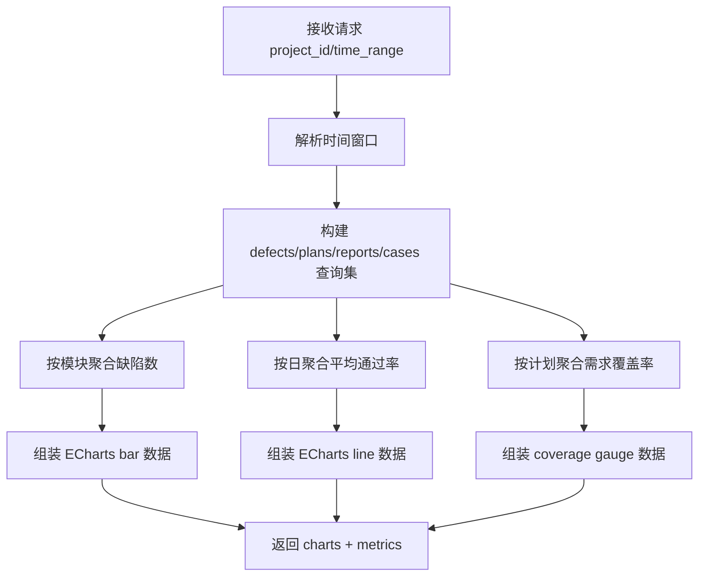

# 15-测试质量分析接口开发文档

## 0. 需求来源与开发动因

- 业务价值摘要：输出可视化质量指标，支撑风险识别与管理决策。
- 业务背景：项目需要可视化质量看板，为测试负责人和管理者提供趋势化决策依据。
- 现状痛点：原始执行与缺陷数据分散，难以直接回答“质量是否改善、风险集中在哪”。
- 建设目标：提供 ECharts 友好聚合接口，统一输出核心质量指标。
- 预期收益：提升质量洞察效率，支撑数据驱动的测试治理与决策。

## 1. 功能概述

新增测试质量分析接口 `QualityDashboardView`，用于聚合质量核心指标并返回前端 ECharts 可直接消费的数据结构，覆盖：

- 各模块缺陷分布（柱状图）；
- 用例通过率趋势（折线图）；
- 需求覆盖率（仪表盘）；
- 统计卡片指标（缺陷密度等）。

---

## 2. 逻辑流程图（Mermaid）

请在文档中使用 Mermaid 语法画出该逻辑的时序图或流程图。



---

## 3. 接口定义

- **URL**：`GET /api/execution/dashboard/quality/`
- **View**：`execution.views.QualityDashboardView`
- **鉴权**：沿用项目默认 DRF Token 鉴权

---

## 4. 入参说明

| 参数名 | 类型 | 必填 | 默认值 | 说明 |
|---|---|---|---|---|
| `project_id` | int | 否 | - | 项目 ID，不传表示全项目汇总 |
| `time_range` | string | 否 | `30d` | 统计窗口，支持：`7d` / `14d` / `30d` / `90d` |
| `pass_rate_mode` | string | 否 | `execution_log` | 通过率口径：`execution_log`（按执行日志）或 `test_report`（按报告） |

---

## 5. 出参字段说明

### 5.1 顶层结构

| 字段 | 类型 | 说明 |
|---|---|---|
| `filters` | object | 本次查询的过滤条件回显 |
| `charts` | object | 前端 ECharts 图表数据 |
| `metrics` | object | 统计指标汇总 |

### 5.2 `charts` 结构

#### `charts.defectByModule`

| 字段 | 类型 | 说明 |
|---|---|---|
| `xAxis` | string[] | 模块名称数组 |
| `series` | object[] | ECharts 序列，`type=bar` |

#### `charts.passRateTrend`

| 字段 | 类型 | 说明 |
|---|---|---|
| `xAxis` | string[] | 日期（`MM/DD`） |
| `series` | object[] | ECharts 序列，`type=line`，`data` 为通过率百分比 |

#### `charts.requirementCoverage`

| 字段 | 类型 | 说明 |
|---|---|---|
| `value` | number | 覆盖率数值 |
| `max` | number | 最大值（固定 `100`） |
| `unit` | string | 单位（`%`） |

### 5.3 `metrics` 结构

| 字段 | 类型 | 说明 |
|---|---|---|
| `total_defects` | int | 时间范围内缺陷总数 |
| `total_cases` | int | 用例总数（按项目过滤） |
| `defect_density` | number | 缺陷密度 |
| `total_requirements` | int | 需求总数（按版本去重后计算） |
| `covered_requirements` | number | 已覆盖需求数（按版本加权估算） |
| `requirement_coverage_rate` | number | 需求覆盖率（%） |

---

## 6. 统计指标计算公式

1. **模块缺陷数**

`模块缺陷数 = count(TestDefect where module = 当前模块 and time in range)`

2. **用例通过率趋势（日）**

`execution_log 口径: 当日通过率(%) = 当日通过执行数 / 当日执行总数 * 100`

`test_report 口径: 当日通过率(%) = avg(TestReport.pass_rate)`

3. **需求覆盖率（时间窗口）**

`总需求数 = Σ avg(req_count) 按 version_id 分组后汇总`

`已覆盖需求数 = Σ (avg(req_count) * avg(coverage_rate) / 100) 按 version_id 分组后汇总`

`需求覆盖率(%) = 已覆盖需求数 / 总需求数 * 100`

4. **缺陷密度**

`缺陷密度 = 缺陷总数 / 用例总数`

---

## 7. ECharts 适配说明

接口返回值已按 ECharts 常见入参组织：

- 分类轴统一使用 `xAxis`；
- 图形数据放入 `series[].data`；
- `defectByModule` 对应柱状图；
- `passRateTrend` 对应折线图；
- `requirementCoverage` 可直接映射仪表盘组件；
- `metrics` 可用于顶部统计卡片。

---

## 8. 数据库变更点

本功能仅为聚合查询，无新增表结构与字段变更。

---

## 9. 安装/配置依赖

本功能复用现有 Django ORM 与 DRF 能力，无新增依赖。部署前仅需确保基础迁移已执行：

```bash
python manage.py migrate
```

---

## 10. 性能优化说明

- 接口增加短缓存（默认 180 秒），缓存键包含：
  - `project_id`
  - `time_range`
  - `pass_rate_mode`
  - `start_date/end_date`
- 在质量看板高并发场景下，优先命中缓存，减少重复聚合查询开销。
