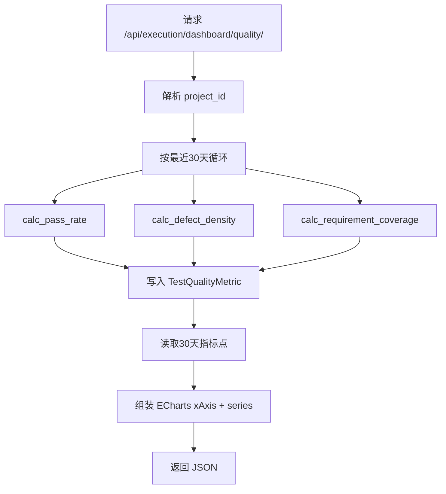

# 16-测试质量统计开发文档

## 0. 需求来源与开发动因

- 业务价值摘要：沉淀日级质量数据资产，支撑长期趋势分析与治理。
- 业务背景：需要将质量指标从“实时计算”升级为“可沉淀、可回看”的日级统计资产。
- 现状痛点：仅靠临时聚合难以支撑趋势分析、跨周期对比和性能可控的数据服务。
- 建设目标：新增指标模型与计算服务，建立质量指标持久化能力。
- 预期收益：形成稳定的趋势分析基础，提升看板响应性能与数据一致性。

## 1. 功能概述

本次在 `execution/` 模块新增测试质量统计能力，核心包括：

- 新增指标模型 `TestQualityMetric`，用于按天持久化质量指标；
- 新增服务类 `MetricCalculator`，统一计算并落库指标；
- 提供 `QualityDashboardView` 接口，返回最近 30 天趋势，适配 ECharts 折线图。

---

## 2. 逻辑流程图（Mermaid）

请在文档中使用 Mermaid 语法画出该逻辑的时序图或流程图。



---

## 3. 数据模型设计

新增模型：`execution.models.TestQualityMetric`

字段定义：

- `metric_date`：指标日期（Date）
- `metric_type`：指标类型（枚举）
  - `defect_density`（缺陷密度）
  - `pass_rate`（用例通过率）
  - `requirement_coverage`（需求覆盖率）
- `metric_value`：指标值（Decimal）
- `dimension`：维度信息（JSON）
  - 当前写入格式：`{"project_id": <id 或 "all">}`

索引：

- `metric_date + metric_type`

---

## 4. 服务类设计

文件：`execution/services/metric_calculator.py`

类：`MetricCalculator`

### 4.1 `calc_pass_rate(project_id, metric_date)`

通过 `ExecutionLog` 计算当日通过率并入库。

**计算公式：**

`用例通过率(%) = 当日通过执行数 / 当日执行总数 * 100`

其中：

- 当日通过执行数：`ExecutionLog.is_passed=True` 条数
- 当日执行总数：`ExecutionLog` 总条数

### 4.2 `calc_defect_density(project_id, metric_date)`

计算当日缺陷密度并入库。

**计算公式：**

`缺陷密度 = 当日缺陷数 / 用例总数`

其中：

- 当日缺陷数：`TestDefect` 在 `metric_date` 创建的数量
- 用例总数：`TestCase` 当前有效数量（按项目过滤）

### 4.3 `calc_requirement_coverage(project_id, metric_date)`

按版本维度计算需求覆盖率并入库。

**计算公式：**

`总需求数 = Σ avg(req_count) (按 version_id 分组)`

`已覆盖需求数 = Σ (avg(req_count) * avg(coverage_rate) / 100) (按 version_id 分组)`

`需求覆盖率(%) = 已覆盖需求数 / 总需求数 * 100`

---

## 5. API 设计

- **URL**：`GET /api/execution/dashboard/quality/`
- **View**：`execution.views.QualityDashboardView`
- **入参**：
  - `project_id`（可选，int）

说明：接口固定返回最近 30 天趋势。

错误返回：

- `400 Bad Request`
  - 场景：`project_id` 非整数
  - 示例：`{"msg": "project_id 必须为整数"}`

缓存策略：

- 缓存键：`quality_dashboard_metric:{project_id|all}:{start_date}:{end_date}`
- TTL：180 秒
- 作用：减少重复统计计算带来的 DB 压力

---

## 6. JSON 响应结构

```json
{
  "filters": {
    "project_id": 1,
    "time_range": "30d",
    "start_date": "2026-03-11",
    "end_date": "2026-04-09"
  },
  "trendChart": {
    "xAxis": ["03/11", "03/12"],
    "series": [
      {"name": "用例通过率(%)", "type": "line", "smooth": true, "data": [85.0, 90.0]},
      {"name": "缺陷密度", "type": "line", "smooth": true, "data": [0.12, 0.08]},
      {"name": "需求覆盖率(%)", "type": "line", "smooth": true, "data": [76.5, 79.2]}
    ]
  },
  "latestMetrics": {
    "date": "2026-04-09",
    "pass_rate": 90.0,
    "defect_density": 0.08,
    "requirement_coverage": 79.2
  },
  "raw": {
    "pass_rate": {
      "metric_type": "pass_rate",
      "points": [{"date": "2026-03-11", "value": 85.0}]
    },
    "defect_density": {
      "metric_type": "defect_density",
      "points": [{"date": "2026-03-11", "value": 0.12}]
    },
    "requirement_coverage": {
      "metric_type": "requirement_coverage",
      "points": [{"date": "2026-03-11", "value": 76.5}]
    }
  },
  "chartsCompat": {
    "passRateTrend": {
      "xAxis": ["03/11", "03/12"],
      "series": [{"name": "用例通过率(%)", "type": "line", "smooth": true, "data": [85.0, 90.0]}]
    },
    "defectDensityTrend": {
      "xAxis": ["03/11", "03/12"],
      "series": [{"name": "缺陷密度", "type": "line", "smooth": true, "data": [0.12, 0.08]}]
    },
    "requirementCoverageTrend": {
      "xAxis": ["03/11", "03/12"],
      "series": [{"name": "需求覆盖率(%)", "type": "line", "smooth": true, "data": [76.5, 79.2]}]
    }
  }
}
```

字段说明：

- `trendChart`：前端 ECharts 直接消费结构（`xAxis + series`）
- `latestMetrics`：最新一天指标卡片
- `raw`：按指标拆分的原始点位数据，便于二次加工
- `chartsCompat`：兼容分图场景（分别返回通过率/缺陷密度/覆盖率趋势）

---

## 7. 数据库变更点

迁移文件：`execution/migrations/0009_testqualitymetric.py`

变更内容：

- 新增表 `test_quality_metric`
- 新增索引 `metric_date + metric_type`

---

## 8. 安装/配置依赖

本功能基于现有 Django ORM 与 DRF，无新增第三方依赖。

执行迁移：

```bash
python manage.py migrate
```

---

## 9. 测试补全

已补充单元测试：`execution/tests.py`

覆盖点：

- `calc_pass_rate`：验证通过率计算与 `TestQualityMetric` 落库；
- `calc_defect_density`：验证缺陷密度公式（缺陷数 / 用例数）；
- `calc_requirement_coverage`：验证按 `version_id` 聚合后的需求覆盖率公式；
- 验证 `dimension.project_id` 维度写入正确。
- `QualityDashboardView`：验证接口响应 JSON 结构、30 天趋势点位、`project_id` 过滤。

集成测试补充：

- `tests/api/test_backend_api_suite.py`
  - 已纳入 `GET /execution/dashboard/quality/` 路由可达性与鉴权覆盖；
  - 已在执行模块回归用例中验证 `trendChart/latestMetrics/raw` 结构与 30 天点位。

接口单元测试补充：

- `execution/tests.py::QualityDashboardViewTestCase`
  - 验证 `project_id` 非法值时返回 `400 Bad Request`；
  - 错误消息包含 `project_id` 参数提示。
