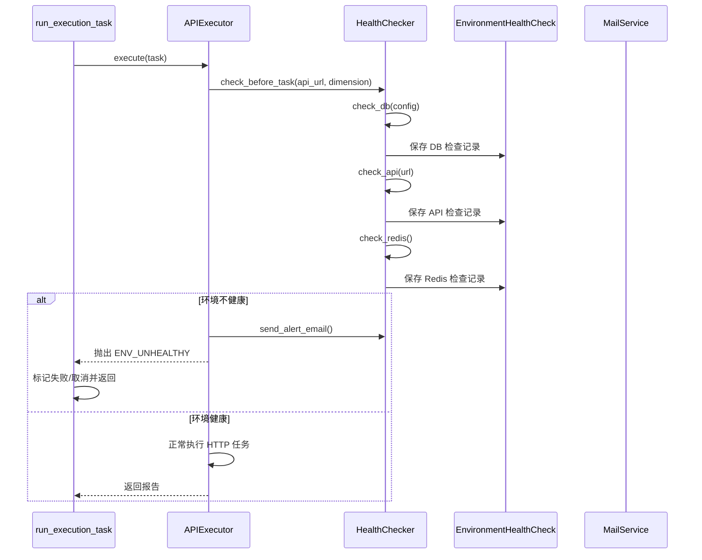

# 17-环境健康检查系统开发文档

## 0. 需求来源与开发动因

- 业务价值摘要：前置环境准入检查，减少无效执行与连锁故障。
- 业务背景：执行任务前需要先确认依赖环境（DB/API/Redis）可用，避免“带病执行”。
- 现状痛点：环境异常时任务仍启动会产生大量无效失败，增加排查噪音并拖慢交付节奏。
- 建设目标：在执行引擎前置健康校验与告警机制，形成统一的准入校验流程。
- 预期收益：实现故障前置拦截和快速感知，降低无效执行与故障扩散风险。

## 1. 功能概述

为 SmartTest 平台环境管理与执行引擎增强“任务前环境健康检查”能力：

- 新增 `EnvironmentHealthCheck` 模型，记录 DB/API/Redis 检查结果；
- 新增 `HealthChecker` 工具类，提供 `check_db`、`check_api` 核心能力；
- 在 `APIExecutor` 中加入执行前自动健康校验；
- 若环境不健康，任务自动取消并发送告警邮件。

---

## 2. 逻辑流程图（Mermaid）

请在文档中使用 Mermaid 语法画出该逻辑的时序图或流程图。



---

## 3. 数据模型设计

模型：`testcase.models.EnvironmentHealthCheck`

字段：

- `check_type`：检查类型（`db` / `api` / `redis`）
- `status`：健康状态（`healthy` / `unhealthy`）
- `response_time_ms`：响应耗时
- `error_log`：错误日志
- `target`：检查目标（如 URL 或 host:port）
- `dimension`：维度信息（JSON）

迁移文件：

- `testcase/migrations/0021_environmenthealthcheck.py`

---

## 4. HealthChecker 设计

文件：`execution/services/health_checker.py`

核心方法：

### 4.1 `check_db(config)`

- 无 `config` 时：使用 Django 默认数据库执行 `SELECT 1`
- 有 `config` 时：通过 TCP 建连检测数据库端口可达性

### 4.2 `check_api(url)`

- 发送 `HEAD` 请求
- 状态码 2xx/3xx 视为健康

### 4.3 `check_before_task(api_url, db_config, dimension)`

- 聚合执行 DB/API/Redis 三类检查
- 返回统一摘要：
  - `ok`
  - `results`
  - `unhealthy`

### 4.4 `send_alert_email(task_name, summary)`

- 目标收件人：`USER_CENTER_ADMIN_EMAIL`（为空则回退 `ADMINS`）
- 内容：不健康项与原因

---

## 5. APIExecutor 集成改造

改动文件：`execution/engine.py`

逻辑：

1. 执行任务前调用 `HealthChecker.check_before_task(...)`；
2. 若存在不健康项：
   - 写健康检查记录；
   - 调用 `send_alert_email`；
   - 抛出 `ENV_UNHEALTHY` 异常；
3. 若健康，继续原执行流程。

---

## 6. 异步任务取消策略

改动文件：`execution/tasks.py`

在 `run_execution_task` 中：

- 捕获 `ENV_UNHEALTHY` 时不进行重试；
- 任务标记为失败并写入：
  - `error_message="环境健康检查失败，任务已取消"`
  - `report.cancelled=true`

---

## 7. 如何扩展自定义检查类型

扩展步骤：

1. 在 `EnvironmentHealthCheck.CHECK_TYPE_CHOICES` 新增类型（如 `mq`）；
2. 在 `HealthChecker` 增加 `check_mq(...)` 方法；
3. 在 `check_before_task(...)` 中注册该检查；
4. 在 `Mermaid` 与接口文档中补充新类型说明；
5. 为新检查补单元测试（成功/失败/超时）。

建议约定：

- 所有检查返回统一结构：`{ok, check_type, response_time_ms, error?}`
- 所有检查都统一落库，便于后续可观测性与历史审计。

---

## 8. 安装/配置依赖

无新增三方依赖，复用现有 `requests`、Django 邮件能力。

执行迁移：

```bash
python manage.py migrate
```

---

## 9. 测试补全

已补充单元测试：`execution/tests.py`

覆盖点：

- `HealthChecker.check_before_task`：
  - 验证 DB/API/Redis 检查结果可落库到 `EnvironmentHealthCheck`；
- `APIExecutor.execute`：
  - 环境不健康时抛出 `ENV_UNHEALTHY`，并触发 `send_alert_email`；
- `run_execution_task`：
  - 捕获 `ENV_UNHEALTHY` 后任务标记取消（`report.cancelled=true`），且不进入重试流程。
- `HealthChecker` 失败分支：
  - API 返回 5xx 时标记 `unhealthy` 并写入检查日志；
  - 默认数据库连接异常时标记 `unhealthy` 并记录错误原因。
