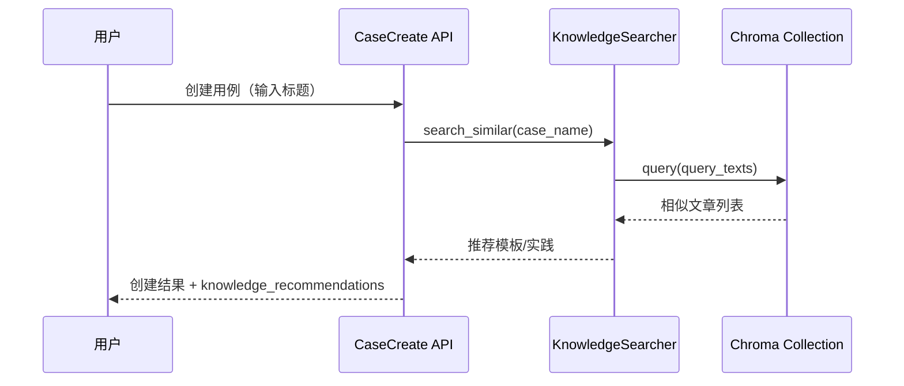

# 18-RAG测试知识库开发文档

## 0. 需求来源与开发动因

- 业务价值摘要：让测试知识可检索可复用，持续提升用例设计质量。
- 业务背景：希望将历史测试经验、模板与 FAQ 结构化沉淀，并在编写用例时即时复用。
- 现状痛点：知识分散在个人经验和文档中，检索成本高，新增用例常出现重复设计与质量不稳。
- 建设目标：建设 RAG 知识库与相似推荐能力，统一知识沉淀与检索入口。
- 预期收益：让测试知识可检索、可复用、可持续演进，提升设计效率与一致性。

## 1. 功能概述

新增基于 RAG 的测试知识库模块，支持：

- 知识文章管理（模板/最佳实践/FAQ）；
- 文章保存后自动同步 ChromaDB 向量索引；
- 语义检索接口 `search_similar(query_text)`；
- 创建测试用例时，根据标题自动返回相似模板推荐。

---

## 2. 逻辑流程图（Mermaid）

请在文档中使用 Mermaid 语法画出该逻辑的时序图或流程图。



---

## 3. 数据模型设计

模型：`assistant.models.KnowledgeArticle`

字段：

- `title`：标题
- `category`：分类
  - `template`（用例模板）
  - `best_practice`（最佳实践）
  - `faq`（FAQ）
- `markdown_content`：Markdown 内容
- `tags`：标签数组（JSON）

迁移文件：

- `assistant/migrations/0001_knowledgearticle.py`

---

## 4. 向量模型选型与 Chroma Collection 结构

文件：`assistant/knowledge_rag.py`

### 4.1 向量模型选型

默认策略：

1. 优先使用 `sentence-transformers` 的 `all-MiniLM-L6-v2`（可通过环境变量 `KNOWLEDGE_EMBED_MODEL` 覆盖）
2. 若本地环境不可用，则回退到 Chroma `DefaultEmbeddingFunction`

### 4.2 Collection 结构

- Collection 名称：`aitest_knowledge_articles`
- 距离空间：`cosine`
- 文档 ID：`ka_{article_id}`
- 文档内容：标题 + 分类 + 标签 + Markdown 正文拼接
- Metadata：
  - `article_id`
  - `title`
  - `category`
  - `tags`（逗号拼接）

---

## 5. 索引与搜索设计

### 5.1 `KnowledgeIndexer`

- `index_article(article_id)`：单篇文章 upsert
- `delete_article(article_id)`：删除索引
- `reindex_all()`：全量重建索引

自动索引触发：

- `assistant/signals.py`
  - `post_save(KnowledgeArticle)` -> `index_article`
  - `post_delete(KnowledgeArticle)` -> `delete_article`

### 5.2 `KnowledgeSearcher`

- `search_similar(query_text, top_k=5)`：
  - 输入查询文本
  - 优先走向量检索（Chroma `query`）
  - 当出现以下任一情况时自动降级到关键词检索（避免 500）：
    - Chroma 不可用/初始化失败
    - 向量查询抛异常（模型下载失败、网络波动、依赖缺失等）
    - 向量检索返回空结果
  - 输出相似文章列表（标题/分类/标签/距离/文档摘要）
  - 每条结果新增 `retrieve_mode` 字段：
    - `semantic`：向量语义检索结果
    - `keyword_fallback`：关键词降级结果

---

## 6. 接口设计

### 6.1 知识库语义搜索接口

- URL：`POST /api/assistant/knowledge/search/`
- 入参：
  - `query_text`（必填）
  - `top_k`（可选，默认 5，范围 1-20）
  - `category`（可选，按分类过滤）
  - `tag`（可选，按标签过滤）
  - `min_score`（可选，相似度阈值，score=1-distance）
- 出参：
  - `success`
  - `query_text`
  - `top_k`
  - `category`
  - `tag`
  - `min_score`
  - `results[]`（每项包含：`article_id/title/category/tags/distance/score/document/retrieve_mode`）

降级行为说明：

- 语义检索不可用时，接口仍返回 `200 + success=true`，并返回关键词匹配结果；
- 降级检索按命中 token 比例计算 `score`，`distance` 固定为 `null`；
- 如无匹配文章，`results` 为空数组，不抛服务端异常。

### 6.1.1 知识文章管理接口

- URL 前缀：`/api/assistant/knowledge-articles/`
- 形态：DRF ViewSet 标准 CRUD
- 用途：维护知识库文章（新增/编辑/删除），触发自动向量索引同步
- 列表筛选：
  - `?category=template`
  - `?tag=登录`

### 6.2 相似用例推荐（创建用例时自动返回）

改动文件：`testcase/views.py` `TestCaseViewSet.create`

- 输入：创建用例请求中的 `case_name`
- 行为：调用 `KnowledgeSearcher.search_similar(case_name, top_k=5)`
- 输出：在创建响应中新增 `knowledge_recommendations` 字段

---

## 7. 数据库变更点

- 新增表：`knowledge_article`
- 新增索引：`category + create_time`

---

## 8. 手动重建索引指令

新增管理命令：`assistant/management/commands/reindex_knowledge_base.py`

执行方式：

```bash
python manage.py reindex_knowledge_base
```

输出示例：

```text
知识库重建完成: total=120 success=120 failed=0
```

---

## 9. 安装/配置依赖

项目已包含 `chromadb` 依赖。可选安装 `sentence-transformers` 以使用更高质量本地嵌入：

```bash
pip install sentence-transformers
```

可选环境变量：

- `KNOWLEDGE_EMBED_MODEL`：覆盖默认向量模型名

---

## 10. 测试补全

已新增测试：`assistant/tests.py`

覆盖点：

- `KnowledgeSearchAPIView`：
  - 验证语义搜索接口返回结构、`top_k/category/tag/min_score` 参数行为；
- 用例创建推荐：
  - 验证创建测试用例响应中包含 `knowledge_recommendations` 字段；
  - 验证推荐字段可携带相似模板结果。
- Signal 自动索引：
  - 验证知识文章保存/删除时触发索引写入与删除；
- 管理命令：
  - 验证 `reindex_knowledge_base` 执行输出与统计结果；
- 文章管理筛选：
  - 验证 `knowledge-articles` 的 `category/tag` 过滤查询。

---

## 11. 2026-04 知识中心升级（文档入库 + 异步 RAG + 前端联动）

本次迭代在原有“知识文章”基础上，新增了“知识文档”全链路：模型、API、Celery 异步处理、前端上传与状态轮询、以及 Celery MySQL Broker 配置。

### 11.1 模型层变更

文件：`assistant/models.py`

`KnowledgeDocument` 新增字段：

- `file_name`：文件名
- `module`：模块分类，关联 `testcase.TestModule`
- `document_type`：文档类型（`pdf/md/url`）
- `source_url`：URL 文档来源地址
- `vector_db_id`：向量库内文档标识

保留并复用字段：

- `status`：`pending/processing/completed/failed`
- `created_at`：上传时间
- `error_message`：失败原因

迁移文件：

- `assistant/migrations/0007_knowledgedocument_document_type_and_more.py`

### 11.2 API 层变更（DRF）

文件：

- `assistant/views.py`
- `assistant/urls.py`
- `frontend/src/api/assistant.js`

新增统一入库接口：

- `POST /api/assistant/knowledge/documents/ingest/`

支持两种模式：

1. `mode=upload`
   - 上传 `file`（当前限制 `.pdf/.md`）
2. `mode=url`
   - 提交 `url`（`http://` 或 `https://`）

接口行为：

- 先创建 `KnowledgeDocument` 记录，状态设为 `pending`
- 随后调用 `process_document_rag.delay(doc_id)` 异步处理
- 返回 `202`，响应中包含创建的文档记录（可作为任务 ID 使用）

### 11.3 Celery 任务逻辑（核心）

文件：`assistant/tasks.py`

任务：`process_document_rag`

处理流程：

1. 状态更新为 `processing`
2. 使用 `UnstructuredFileLoader` 解析上传文档（PDF/MD）
3. 使用 `RecursiveCharacterTextSplitter` 切片：
   - `chunk_size=800`
   - `chunk_overlap=100`
4. 为每个 chunk 注入元数据：
   - `doc_id`
   - `module_id`
   - `chunk_index`
   - `document_type`
   - `file_name`
   - `source_url`
5. 向量化并写入本地 Chroma 持久化目录
6. 成功则更新为 `completed` 并回写 `vector_db_id`
7. 异常捕获后更新为 `failed`，写入 `error_message`

Embedding 提供方：

- 默认 OpenAI（`OpenAIEmbeddings`）
- 可切换 Ollama（`OllamaEmbeddings`）
- 通过 `KNOWLEDGE_EMBEDDING_PROVIDER` 等配置选择

### 11.4 前端页面联动（知识中心）

文件：`frontend/src/views/system/KnowledgeCenter.vue`

新增能力：

- 新增“知识文档入库”区域（Element Plus 暗黑科技风）
- 支持文件上传与 URL 提交（均走 `/ingest/`）
- 上传成功后自动刷新文档列表并启用轮询
- 文档状态标签颜色：
  - `processing`：蓝色
  - `completed`：绿色
  - `failed`：红色
- 原弹窗上传入口已统一切换到 `/ingest/`，避免双链路不一致

### 11.5 Celery Broker 改为 MySQL（无需 Redis）

文件：`AITestProduct/settings.py`

改动要点：

- `CELERY_BROKER_URL` 默认改为 `sqla+mysql+pymysql://...`
- 连接串自动复用 `DATABASES["default"]` 的 `USER/PASSWORD/HOST/PORT/NAME`
- `CELERY_RESULT_BACKEND` 默认改为 `django-db`
- 若安装了 `django-celery-results`，自动加入 `INSTALLED_APPS`

说明：配置中对账号密码做了 URL 编码，避免特殊字符导致连接串解析失败。

### 11.6 本地已执行的命令（已完成）

已安装依赖：

```bash
python -m pip install sqlalchemy pymysql django-celery-results
```

已执行迁移：

```bash
python manage.py migrate
```

关键结果：

- `assistant.0007_knowledgedocument_document_type_and_more` 已应用
- `django_celery_results` 全部迁移已应用（`0001` 到 `0014`）

### 11.7 运行建议

- 启动 Celery Worker 前，确认 MySQL 可连接且账号有读写权限
- 建议先在本地上传一个小型 `.md` 文件验证状态流转：
  - `pending -> processing -> completed`
- 若出现 `failed`，优先查看 `knowledge_document.error_message` 与 worker 日志
