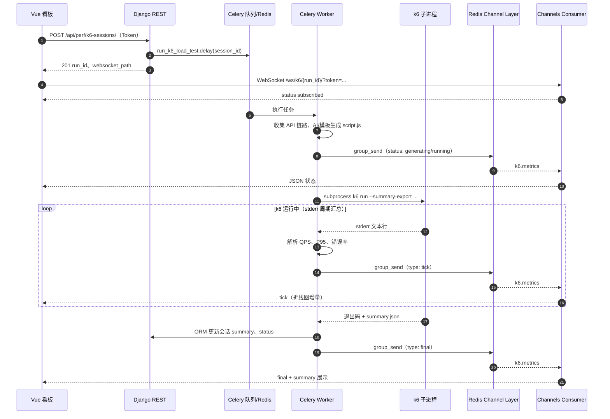

# 19-性能压测与监控模块开发文档

## 1. 模块概述与技术选型

### 1.1 背景

AITesta 平台已具备 **Django + DRF** 管理 API 测试用例、**Celery** 执行异步任务、**Vue + Element Plus** 搭建工作台的能力。业务方希望将「接口测试用例所描述的业务链路」快速转化为可重复、可加压的性能测试，并在压测过程中获得**近实时**的 QPS、延迟分位数与错误率曲线，而不是仅依赖事后日志。

### 1.2 技术选型

| 能力 | 选型 | 说明 |
|------|------|------|
| 发压引擎 | **k6**（JavaScript 脚本） | 与现有 Vue/JS 技术栈一致，单机 CLI 易集成；支持 `summary-export` 产出结构化结果。 |
| 脚本生成 | **大模型 +确定性模板** | 优先通过 Prompt 将链路 JSON 转为 k6 脚本；模型不可用或输出不合法时回退模板生成。 |
| 异步调度 | **Celery** | 与执行引擎、知识库等模块一致；任务内 `subprocess` 拉起 k6，避免阻塞 HTTP 请求。 |
| 实时推送 | **Django Channels + Redis** | WebSocket 长连接；`RedisChannelLayer` 与现有 Redis 基础设施复用。 |
| 前端可视化 | **ECharts** | 项目已依赖 ECharts 5；双图分别展示 QPS 与 P95/错误率。 |

本模块**不强制**引入时序数据库；指标来自 k6 标准错误输出解析与结束时的 `summary.json`。若后续需长期存储，可再接 InfluxDB / Prometheus。

---

## 2. 架构与数据流图

### 2.1 组件关系（逻辑）

- **前端**：提交用例 ID 列表与压测参数 → 建立 WebSocket → 接收 `tick` / `final` 消息并驱动图表。
- **Django REST**：持久化 `K6LoadTestSession`，投递 Celery，返回 `run_id` 与 WebSocket 路径。
- **Celery Worker**：拉取用例 → AI/模板生成 `script.js` → `k6 run --summary-export ...` → 解析 stderr 周期性指标 → `group_send`。
- **Channels**：Consumer 将进程加入组 `k6_run_<run_id>`，转发组消息到浏览器。

### 2.2 时序图（Mermaid）



---

## 3. 核心 API 与 WebSocket 契约

### 3.1 创建压测会话

- **方法 /路径**：`POST /api/perf/k6-sessions/`
- **认证**：`Authorization: Token <token>`（与全局 DRF 配置一致）

**请求体（JSON）**

| 字段 | 类型 | 必填 | 说明 |
|------|------|------|------|
| `test_case_ids` | `int[]` | 是 | 按顺序组成业务链路的 **API 测试用例**主键列表。 |
| `vus` | `int` | 否 | 虚拟用户数，默认 `5`，范围建议 `1–500`。 |
| `duration` | `string` | 否 | k6 时长，如 `30s`、`5m`、`1h`，默认 `30s`。 |
| `use_ai` | `bool` | 否 | 是否调用大模型生成脚本，默认 `true`；失败自动回退模板。 |
| `target_base_url` | `string` | 条件 | 用例里 API 地址为相对路径时**必填**，用于拼接完整 URL。 |

**响应 `201` 主要字段**

| 字段 | 说明 |
|------|------|
| `run_id` | UUID，WebSocket 路径与 ORM 查询键。 |
| `status` | `pending` / `generating` / `running` / `completed` / `failed`。 |
| `websocket_path` | 如 `/ws/k6/<run_id>/`（浏览器需带 `?token=`）。 |
| `websocket_url_hint` | 开发环境经 Vite 代理的提示文案。 |

**查询详情**：`GET /api/perf/k6-sessions/<run_id>/`  
返回脚本快照 `script_body`、最终 `summary`、`error_message` 等（只读）。

### 3.2 WebSocket

- **URL**：`ws(s)://<host>/ws/k6/<run_id>/`
- **查询参数**：`token=<DRF Token>`（与 REST 同源认证）

**服务端 → 客户端消息体**（JSON 文本帧，无外层 envelope）

#### 3.2.1 订阅成功

```json
{
  "type": "status",
  "phase": "subscribed",
  "run_id": "550e8400-e29b-41d4-a716-446655440000",
  "message": "已订阅实时指标"
}
```

#### 3.2.2 生命周期状态（可选多条）

```json
{
  "type": "status",
  "phase": "generating",
  "message": "正在生成 k6 脚本"
}
```

```json
{
  "type": "status",
  "phase": "running",
  "message": "k6 进程已启动",
  "generation_source": "ai",
  "ai_note": "若从 AI 回退到模板，可在此附模型错误摘要"
}
```

#### 3.2.3 实时采样（心电图数据源）

约每 **0.55s** 至多推送一次（去抖），字段来自 k6 控制台汇总行解析：

```json
{
  "type": "tick",
  "ts": 1712730123.456,
  "qps": 23.55,
  "http_reqs_total": 1417,
  "p95_ms": 125.0,
  "error_rate": 0.0
}
```

说明：

- `qps`：由 `http_reqs` 行的 `/s` 值解析。
- `p95_ms`：由 `http_req_duration` 行中 `p(95)=...` 解析并统一为毫秒。
- `error_rate`：`http_req_failed` 行的百分比转为 `0~1` 小数；缺省可不出现。

#### 3.2.4 结束帧

```json
{
  "type": "final",
  "exit_code": 0,
  "summary": { },
  "error_message": null
}
```

- `summary`：与 k6 `--summary-export` 写入的 JSON 结构一致（对象或 `null`）。
- `exit_code != 0` 时 `error_message` 可能含 stderr 尾部摘要。

#### 3.2.5 错误帧

```json
{
  "type": "error",
  "message": "未找到 k6 可执行文件，请安装 k6 并加入 PATH"
}
```

---

## 4. 环境依赖与部署指南

### 4.1 Python 依赖

在仓库 `requirements.txt` 中已增加：

- `channels>=4.0`
- `channels-redis>=4.2`
- `daphne>=4.0`

安装：

```bash
pip install -r requirements.txt
```

数据库迁移：

```bash
python manage.py migrate execution
```

### 4.2 系统依赖

| 组件 | 用途 | 安装提示 |
|------|------|----------|
| **Redis** | Celery Broker、Channels Layer | 与现有 `CELERY_BROKER_URL` / `CHANNEL_REDIS_*` 一致；默认 `127.0.0.1:6379`。 |
| **k6** | 实际发压 | 见 [k6 安装文档](https://k6.io/docs/get-started/installation/)；确保 `k6` 在 Worker 所在机器 `PATH` 中。 |
| **MySQL** | 会话与用例存储 | 沿用项目配置。 |

### 4.3 运行方式（重要）

- **WebSocket 需要 ASGI 进程**：`python manage.py runserver` 为 WSGI，**不能**承载 Channels WebSocket。开发/生产请使用：

```bash
daphne -b 0.0.0.0 -p 8000 AITestProduct.asgi:application
```

- **Celery Worker**（与现网一致）：

```bash
celery -A AITestProduct worker -l info
```

- 未安装 Celery 时，创建会话仍会写库；服务端会尝试**后台线程**降级执行（仅便于开发，生产务必使用 Worker）。

### 4.4 前端- 已依赖 **ECharts**，无需额外安装。
- **Vite 开发代理**：`vite.config.js` 增加 `/ws` →后端，支持 `ws: true`，便于 `ws://localhost:5173/ws/...` 连到 Daphne。

### 4.5 生产反向代理

若前端静态资源与 API 同域，Nginx 需为 `/ws/` 配置 **Upgrade** 与 **Connection** 头，将 WebSocket 转发至 Daphne；`/api/` 仍走 HTTP 上游。

### 4.6 代码与配置索引（便于维护）

| 类型 | 路径 |
|------|------|
| 模型 | `execution/models.py` → `K6LoadTestSession` |
| AI 生成 | `execution/services/k6_ai_generator.py` |
| 模板生成 | `execution/services/k6_template_generator.py` |
| 用例收集 | `execution/services/k6_chain_builder.py` |
| stderr 解析 | `execution/services/k6_stderr_parser.py` |
| Celery 任务 | `execution/tasks_k6.py` |
| REST | `execution/views_k6.py`，路由 `execution/perf_urls.py` |
| WebSocket | `execution/consumers.py`、`execution/routing.py`、`execution/middleware_ws.py` |
| ASGI | `AITestProduct/asgi.py` |
| 设置 | `AITestProduct/settings.py`（`INSTALLED_APPS`、`ASGI_APPLICATION`、`CHANNEL_LAYERS`） |
| 前端看板 | `frontend/src/views/performance/LoadTestMonitor.vue` |
| API封装 | `frontend/src/api/perfK6.js` |

---

## 5. 安全与限制说明

- WebSocket 连接需**已登录 Token**；Consumer 会拒绝匿名连接。
- `vus` 与脚本复杂度直接影响目标环境与 Worker 主机负载，请在预发环境验证后再对生产加压。
- AI 生成脚本需人工抽检；模板路径为确定性输出，更适合合规场景。

---

*文档版本：与代码变更同步维护；编号19 对应「性能压测与监控」专题。*
