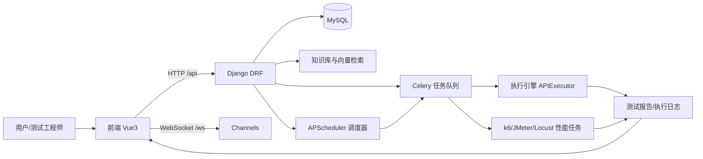
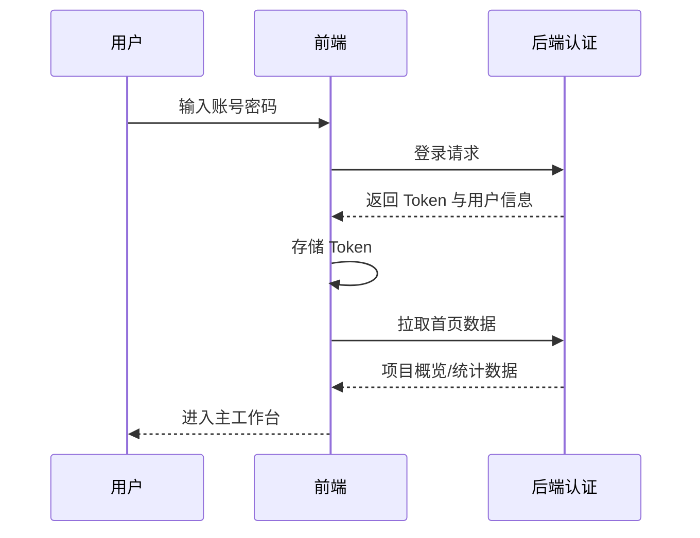
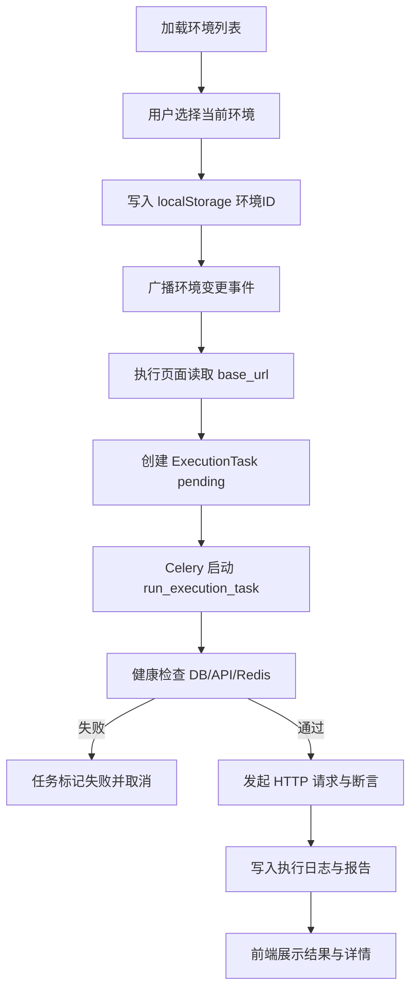
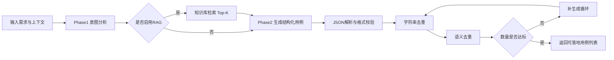
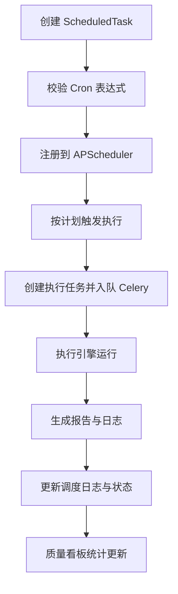
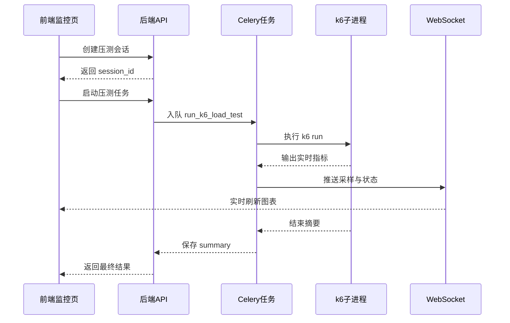

# 22-全项目功能演讲稿（5000字以上）

## 0. 演讲目标与使用说明

这份文档面向“明天项目演讲”场景，不是简单的技术清单，而是把项目的**业务价值、技术架构、功能闭环、关键难点与风险控制**串成一个完整叙事。你可以直接把它当讲稿，也可以按章节拆成 PPT。  
如果时间是 10-15 分钟，建议重点讲第 1、2、4、7、8、9 章；如果时间是 20-30 分钟，可完整覆盖并配合流程图逐段解释。

本文核心回答五个问题：
- 这个项目到底在解决什么问题？
- 所有功能分别是干什么的？
- 为什么要开发这些“复杂功能/蛇蝎功能”？
- 这些功能之间如何协同形成闭环？
- 未来如何继续演进，避免系统复杂度失控？

---

## 1. 项目全景：这不是“测试工具”，而是“测试生产系统”

项目名称是 SmartTest（AITestProduct）。如果只看页面，它像一个测试管理平台；如果看系统能力，它更像一个“**测试生产系统**”：从测试资产沉淀、环境治理、自动执行、质量分析，到 AI 辅助生成与知识库增强，形成了从“想法”到“结果”的可追踪链路。

### 1.1 业务痛点

传统测试工作常见五类痛点：
- 测试资产分散：用例、步骤、环境、报告分散在多个工具；
- 执行不可控：依赖人工触发，失败原因不透明，复现成本高；
- 环境不稳定：测试失败不一定是代码问题，可能是环境异常；
- 质量指标滞后：没有统一的统计口径，管理层看不到实时风险；
- 用例产出慢：需求变化快，人工写用例速度追不上迭代节奏。

### 1.2 项目定位

本项目的定位不是“替代测试人员”，而是“放大测试组织能力”，具体体现在：
- 用平台把测试流程标准化，减少重复动作；
- 用执行引擎和调度把回归自动化，减少人为波动；
- 用 AI 和知识库提高产能，让测试设计更快进入可执行阶段；
- 用报告和统计建立质量闭环，让决策基于数据而非感觉。

---

## 2. 总体架构：前后端分离 + 异步执行 + AI/RAG 增强

系统采用前后端分离架构，核心分为四层：
- **表现层（前端）**：Vue3 + Element Plus，负责交互与可视化；
- **业务层（Django DRF）**：承载用户、项目、用例、执行、缺陷、AI 等业务 API；
- **异步与调度层（Celery + APScheduler + Channels）**：处理耗时任务、定时任务、实时推送；
- **数据与知识层（MySQL + 向量索引）**：存储业务数据与知识库语义索引。

### 2.1 架构关系图（可直接放 PPT）

### 2.2 架构设计的关键取舍

- **为什么要异步执行？**  
  API 执行、AI 生成、知识索引、性能压测都可能是秒级到分钟级，若走同步请求会导致前端超时、接口拥塞、用户体验差。异步把“触发任务”和“任务完成”解耦，系统更稳定。

- **为什么要实时通道（WebSocket/SSE）？**  
  AI 生成与性能监控天然需要“边产出边反馈”。用户不应等待一个黑盒结果，而应看到实时进展，这对可用性和信任感都很关键。

- **为什么要做统一文档体系？**  
  这个项目模块多、演进快。文档不是附属物，而是“第二代码库”，帮助新成员理解系统边界、快速定位问题、降低知识单点风险。

---

## 3. 功能地图：每个模块在做什么

下面按业务模块解释“功能是什么、解决什么问题、为什么这样做”。

## 3.1 用户与组织模块（`user/`）

**功能是什么**：账号、组织、角色、系统消息、敏感信息变更申请等治理能力。  
**解决什么问题**：保证系统不是“单人脚本”，而是可协作、可审计、可治理的平台。  
**为什么这样做**：测试平台一旦进入团队使用阶段，权限与审计是底线，否则任何误操作都会变成生产事故。

价值总结：
- 提供权限基础，减少“谁都能改、谁都能删”风险；
- 提供消息机制，让关键事件可通知；
- 为后续流程审批（如敏感配置变更）提供组织基础。

## 3.2 项目管理模块（`project/`）

**功能是什么**：测试项目、测试任务、发布计划等实体管理。  
**解决什么问题**：把零散测试活动绑定到“项目与版本”，形成上下文。  
**为什么这样做**：没有项目维度，执行与报告只是孤立数据，无法支撑发布决策。

价值总结：
- 把“用例、执行、缺陷、报告”串到同一项目主线；
- 支持发布计划关联，为快照和回溯提供锚点。

## 3.3 测试用例模块（`testcase/`）

这是平台最核心的资产层，含测试模块树、测试用例、步骤、类型扩展（API/性能/安全/UI）等。

**功能是什么**：
- 用例生命周期管理：创建、编辑、查询、执行、归档；
- 步骤化描述，支持结构化维护；
- 多类型扩展，统一基类下管理不同测试形态。

**解决什么问题**：
- 让测试资产可复用、可继承、可批量管理；
- 避免“用例写在文档里、执行在别处、版本又在别处”的割裂。

**为什么这样做**：
- 使用基类 + 子类型扩展，是为了兼顾统一管理和差异字段；
- 支持批量操作，是为了适应真实项目中“几十上百条”用例调整；
- 与发布计划联动的版本快照，是为了确保回归可追溯。

## 3.4 环境管理模块（`testcase` 环境相关）

**功能是什么**：测试环境实体与环境变量治理，支持敏感变量加密存储。  
**解决什么问题**：
- 多环境切换（开发/测试/预发/生产镜像）一致化；
- 避免把密钥、口令明文散落在用例中。

**为什么这样做**：
- 环境是测试稳定性的第一前提；
- 变量加密是安全基线，不是“可选优化”。

价值总结：
- 降低误测到错误环境的风险；
- 提升配置安全性和合规性；
- 为执行引擎、性能任务提供统一 base_url 来源。

## 3.5 测试执行模块（`execution/`）

**功能是什么**：
- API 执行任务创建与异步执行；
- 测试计划与报告管理；
- 执行日志、追踪字段、结果回填；
- Dashboard 统计聚合。

**解决什么问题**：
- 从“手工点点点”升级到“可并发、可重试、可追溯”执行；
- 结果不是“成功/失败”二元结论，而是带证据链的结构化记录。

**为什么这样做**：
- 真实环境下失败原因复杂，不记录上下文就无法定位；
- 异步任务必须有状态机，不然会出现未知状态和重复执行。

价值总结：
- 建立执行可靠性；
- 建立问题复盘能力；
- 为质量分析提供真实、可计算的数据源。

## 3.6 定时调度模块（`execution/scheduler`）

**功能是什么**：基于 APScheduler 的定时触发系统，支持任务创建、启停、立即触发、日志记录。  
**解决什么问题**：把回归从“靠人记得跑”升级为“系统按策略跑”。  
**为什么这样做**：没有调度，自动化只是“半自动化”，且人力成本会在迭代高峰期急剧上升。

价值总结：
- 降低漏测概率；
- 保证回归节奏可预期；
- 沉淀任务历史，便于问题追踪。

## 3.7 测试质量分析与统计（`execution` 质量相关）

**功能是什么**：通过率趋势、缺陷分布、覆盖指标等聚合接口，支持看板展示。  
**解决什么问题**：管理层和研发负责人需要“趋势”和“结构”，而不是单次执行详情。  
**为什么这样做**：质量治理本质是持续改进，需要可视化与可比较的数据面板。

价值总结：
- 从“主观感受”变为“客观指标”；
- 支持阶段汇报与决策（是否发布、是否加测、是否回滚）。

## 3.8 缺陷管理模块（`defect/`）

**功能是什么**：缺陷记录、状态流转、与测试结果关联。  
**解决什么问题**：让测试输出可执行，不只停留在“报告里写了失败”。  
**为什么这样做**：测试价值最终体现在“问题被发现并闭环修复”。

价值总结：
- 形成“发现问题 -> 定位问题 -> 跟踪修复”的路径；
- 使测试报告和研发改进形成因果闭环。

## 3.9 AI 助手模块（`assistant/`）

**功能是什么**：
- 模型连通性测试与配置；
- 同步/流式用例生成；
- RAG 检索增强；
- 去重与补生成机制。

**解决什么问题**：
- 测试设计阶段瓶颈：人工从需求到可执行用例太慢；
- 生成质量不稳定：需结合知识库和历史资产提升可用性。

**为什么这样做**：
- 仅靠“大模型裸输出”不可控，因此引入 RAG；
- 仅靠“字符串去重”不够，因此加语义去重；
- 仅靠一次生成不稳，因此加入最小条数补生成策略。

价值总结：
- 显著缩短用例初稿产出周期；
- 让 AI 结果更贴近项目上下文；
- 在效率和质量之间寻找可调平衡点。

## 3.10 RAG 测试知识库（`assistant` 知识中心）

**功能是什么**：知识文章管理、向量索引、语义检索、相似用例推荐、异步重建。  
**解决什么问题**：避免 AI 生成“通用正确但场景错误”的内容。  
**为什么这样做**：企业内测试经验是高价值资产，必须可检索、可复用、可持续更新。

价值总结：
- 把“经验”转成“可计算知识”；
- 提高 AI 生成内容的项目相关性；
- 长期累积后形成组织知识壁垒。

## 3.11 性能压测与实时监控（`execution/views_k6.py` 等）

**功能是什么**：创建压测会话、触发 k6 任务、实时指标推送、前端图表监控。  
**解决什么问题**：压测结果不能只看最终报告，还要看过程波动与实时异常。  
**为什么这样做**：容量风险常在“峰值瞬间”，实时监控能更早发现拐点。

价值总结：
- 支持性能风险前置发现；
- 为容量评估和发布评审提供证据；
- 提升演示效果与团队信心（可视化价值高）。

---

## 4. “蛇蝎功能”解释：为什么必须做，为什么难做

你提到“为什么开发蛇蝎功能”，这里把它定义为：**复杂、难调、容易出问题，但业务价值非常高的关键能力**。这些能力不做，系统只能算“工具集合”；做了，系统才是“可持续运行的平台”。

## 4.1 蛇蝎功能一：AI 生成 + RAG + 双重去重

### 必要性
- 直接决定平台 AI 是否“能用”而非“能演示”；
- 决定测试团队是否愿意把 AI 纳入日常流程。

### 技术复杂点
- 上游模型结果不稳定（格式飘逸、超时、限流）；
- 检索片段过多会拖慢生成，过少又会失真；
- 去重阈值很难调：高了会误杀，低了会重复。

### 为什么必须承担这份复杂度
- 企业场景不能接受“看起来聪明但不可落地”的答案；
- 必须把“生成质量可控”当成工程问题，而不是模型玄学。

### 控制思路
- 两阶段生成（理解 -> 生成）；
- RAG 参数化（Top-K、上下文长度）；
- 结果校验 + 补生成；
- 字符串 + 语义双重去重。

## 4.2 蛇蝎功能二：执行前环境健康检查 + 异步重试幂等

### 必要性
- 很多执行失败不是用例问题，而是环境本身不可用；
- 如果不拦截，失败数据会污染质量指标，还浪费算力。

### 技术复杂点
- 如何判断“临时抖动”与“真实故障”；
- 如何避免重复执行导致数据重复或状态错乱；
- 如何在失败时仍保留足够证据用于排查。

### 为什么必须承担这份复杂度
- 平台可信度来自“失败可解释”，而不是“失败就重跑”；
- 没有幂等和锁机制，规模稍大就会出现并发灾难。

### 控制思路
- 缓存锁 + 行锁双保险；
- 明确失败类型（可重试/不可重试）；
- 报告结构化落盘，保留 trace 与请求响应。

## 4.3 蛇蝎功能三：定时调度自动回归

### 必要性
- 发布频率高时，人工触发回归无法持续；
- 每次“忘记回归”都可能演变成线上事故。

### 技术复杂点
- 多实例部署下可能重复触发；
- Cron 配置错误会出现任务风暴；
- 任务链路长，任何环节异常都可能导致调度失真。

### 为什么必须承担这份复杂度
- 自动化价值在“持续”而不在“偶尔运行”；
- 调度系统是测试平台进入工程化的分水岭。

### 控制思路
- max_instances、错过触发处理、日志审计；
- 任务状态机约束；
- 出错可回放、可追踪、可告警。

## 4.4 蛇蝎功能四：k6 实时监控链路

### 必要性
- 性能风险往往是动态变化，只有终态报告不够；
- 实时图对沟通和决策极其有效，尤其在联调会和发布会。

### 技术复杂点
- 子进程运行稳定性；
- 解析实时输出并推送到前端图表；
- 长任务的资源占用和中断恢复。

### 为什么必须承担这份复杂度
- 性能治理要“看过程、看趋势、看峰值”，不是“只看结果”；
- 这是系统从“功能完善”迈向“可观测工程”的关键一步。

---

## 5. 核心端到端流程（讲清楚系统是怎么跑起来的）

## 5.1 流程一：用户登录到进入工作台

这条链路看似简单，但它定义了系统“安全与体验”的起点。Token 注入、401 处理、路由守卫统一在请求层处理，减少了页面层重复逻辑，也降低了安全漏洞概率。

## 5.2 流程二：环境选择 -> API 执行

这条流程体现了一个关键理念：**执行前置校验优先于盲目执行**。  
平台不是为了“多跑几次”，而是为了“让每次执行都可信”。

## 5.3 流程三：AI 生成用例（含 RAG 增强）

这条流程回答了“为什么 AI 不是一个接口调用就完事”。  
真正可用的 AI 需要工程化编排：策略、校验、去重、补偿缺一不可。

## 5.4 流程四：定时调度自动回归

这条流程体现“规模化运营”的本质：把人的记忆变成系统机制。

## 5.5 流程五：k6 压测实时监控

---

## 6. 从“功能列表”到“业务闭环”：平台真正的价值链

如果把系统能力串起来，可以看到完整闭环：

1) 在项目中管理用例资产与环境；  
2) 用 AI 加速生成初稿并结合知识库提升质量；  
3) 用执行引擎按环境稳定执行并产出报告；  
4) 用缺陷管理把问题推进到修复；  
5) 用质量统计看趋势，反向指导下一轮测试重点；  
6) 用调度系统实现持续回归；  
7) 用性能监控提前识别容量与稳定性风险。

这条闭环的意义是：  
**把“测试活动”变成“持续产生价值的系统流程”**，而不是靠个体经验驱动的碎片化动作。

---

## 7. 为什么这些功能值得做：业务与工程双视角解释

## 7.1 业务视角

- 管理层看重的是“风险可控、节奏可控、质量可见”；  
- 研发团队看重的是“反馈及时、定位高效、沟通成本低”；  
- 测试团队看重的是“产能提升、重复工作减少、经验可复用”。

本项目恰好对应三类诉求：
- 通过执行与统计，给出可量化质量画像；
- 通过日志与报告，提升问题定位效率；
- 通过 AI 与知识库，提升用例产出效率与覆盖质量。

## 7.2 工程视角

- 架构上采用异步与实时机制，承载高耗时任务；
- 模块上采用分域解耦，便于迭代和排障；
- 数据上强调可追溯，保证失败可解释；
- 安全上强调权限与敏感数据保护，降低治理风险。

一句话概括：  
**这个项目不是为了“功能多”，而是为了“把复杂测试场景变成可运行、可观测、可演进的工程系统”。**

---

## 8. 演讲中可重点强调的“创新点/亮点”

建议至少讲下面 6 个亮点：

1. **AI 生成工程化**：不是单次调用模型，而是“两阶段 + RAG + 去重 + 补生成”的可控流水线。  
2. **执行前健康检查**：避免无效执行，减少噪音失败，提高结果可信度。  
3. **异步执行可追溯**：任务状态、trace、请求响应脱敏记录完整，支持深度排查。  
4. **测试资产快照回溯**：发布计划绑定用例版本，保证历史可还原。  
5. **定时调度自动回归**：把回归从人肉触发升级到平台机制。  
6. **性能监控实时可视化**：k6 + WebSocket + 图表，动态观察性能拐点。

这些亮点对应你演讲中的“难而正确”叙事：  
平台真正的竞争力往往来自那些复杂但关键的工程能力。

---

## 9. 风险与治理：展示成熟度的关键章节

技术演讲如果只讲“成功案例”，会显得不真实。建议你主动讲风险与治理，体现工程成熟度。

## 9.1 主要风险

- AI 结果波动：模型稳定性与上下文依赖强；
- 环境依赖波动：网络、数据库、缓存可能造成误判；
- 调度复杂性：错误配置可导致任务风暴；
- 实时链路脆弱：WebSocket、中间件、子进程任一环节异常都会影响体验。

## 9.2 治理策略

- 参数化与开关化：关键阈值可配置，可按环境调优；
- 明确状态机：任务状态转换可验证、可审计；
- 错误分类处理：重试与不可重试分开；
- 日志证据链：从触发到结果全链路可回放；
- 文档化交付：功能上线附带文档与检查清单。

## 9.3 你可以直接讲的一句话

“我们不是追求零故障，而是追求故障可定位、可恢复、可复盘。系统稳定性来自机制，而不是运气。”

---

## 10. 面向明天演讲的建议讲稿结构（可直接照着讲）

### 10.1 15 分钟版

- 第 1 分钟：项目背景与痛点（为什么做）  
- 第 2-4 分钟：架构总览（四层架构 + 总图）  
- 第 5-8 分钟：核心流程（环境选择、执行、AI 生成）  
- 第 9-11 分钟：蛇蝎功能与风险控制（挑 2-3 个讲深）  
- 第 12-13 分钟：业务价值与结果（效率、质量、协同）  
- 第 14-15 分钟：后续规划与答疑引导

### 10.2 20-30 分钟扩展版

在 15 分钟版基础上增加：
- 快照回溯与调度系统细节；
- k6 实时监控链路；
- 指标治理与质量看板口径；
- 文档体系与上线保障机制。

---

## 11. 后续演进方向（你可以作为“展望”章节）

建议从四个方向演进：

1. **更强 AI 可控性**：引入质量评分器、用例可执行性自动校验、失败样本反哺。  
2. **更强可观测性**：统一 trace_id 到前后端，完善任务全链路时延分析。  
3. **更强治理能力**：调度模板库、环境策略中心、分级告警策略。  
4. **更强生态对接**：对接更多执行器与缺陷系统，形成更开放平台。

---

## 12. 一段可直接背诵的总结陈词

这套系统的核心价值，不在于“功能越多越好”，而在于把测试工作中最耗时、最不稳定、最难沉淀的环节，逐步工程化、产品化、平台化。  
我们通过统一资产管理打基础，通过异步执行和调度提升稳定性，通过报告和统计形成质量闭环，再通过 AI 和知识库提升效率与智能化程度。  
那些看起来复杂的“蛇蝎功能”，比如 RAG 增强生成、健康检查拦截、幂等执行、实时性能监控，之所以必须投入，是因为它们直接决定了平台能否在真实团队和真实迭代节奏下长期运行。  
从结果看，这个项目已经不仅是一个“测试工具集合”，而是一个可持续进化的测试生产系统：它既能服务今天的交付，也能支撑未来的规模化质量治理。

---

## 13. 附：演讲时可引用的关键词（便于你快速组织语言）

- 测试生产系统  
- 全流程闭环  
- 异步执行与可追溯  
- 环境治理与安全基线  
- AI 工程化而非 Demo 化  
- RAG 增强与语义去重  
- 定时调度与持续回归  
- 实时可观测与性能风险前置  
- 指标驱动质量决策  
- 机制化稳定性

---

> 备注：本讲稿内容已覆盖项目核心模块与关键流程，篇幅超过 5000 字，且内含可直接用于 PPT 的 Mermaid 流程图。你可以按章节裁剪成 10 分钟、15 分钟或 30 分钟版本。
