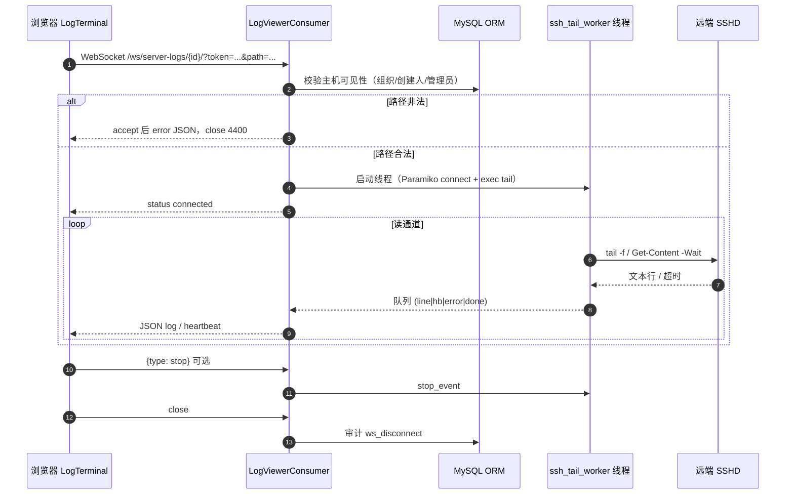
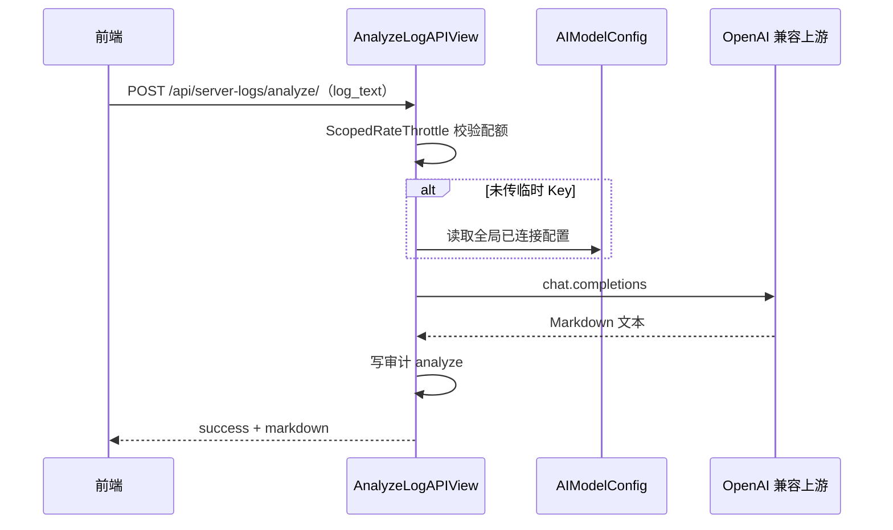

# 22-服务器日志监控模块开发文档

## 0. 需求来源与开发动因

- **业务价值摘要**：在自动化测试平台内集中管理多机 SSH 日志查看入口，支持浏览器端实时 tail、划选日志一键 AI 诊断，并为后续集中检索预留扩展点。
- **业务背景**：联调与线上排障依赖 SSH 登录各机 `tail -f`，上下文分散、无留痕；测试团队希望与 AITesta 账号体系统一，并避免凭证明文落库。
- **现状痛点**：凭据分散、无统一审计；普通用户与管理员可见范围不一致时易出现「列表可见但 WebSocket 被拒」；大流量日志易导致前端卡顿或后端队列阻塞。
- **建设目标**：建设 **服务器日志** 模块——加密存储 SSH 配置、Channels + Paramiko 实时推送、复用平台 AI 配置的诊断接口、可选 Loki 历史检索、组织级共享与操作审计、AI 调用限流。
- **预期收益**：降低排障门槛、提升安全与合规（加密、审计、路径校验）、便于运维协同（组织共享）。

---

## 1. 模块目标与范围

### 1.1 核心能力

| 能力 | 说明 |
|------|------|
| 远程主机配置 | 多主机 SSH 参数（密码/私钥 **Fernet 密文**）；可选绑定 **组织** 实现成员共享。 |
| 实时日志流 | **WebSocket** + 远端 **`tail -n 200 -f`**（Linux）或 **PowerShell Get-Content -Wait**（Windows）。 |
| AI 异常诊断 | 前端划选日志 → **POST** 分析接口 → 调用与「智能助手」一致的 **AIModelConfig**（可请求体临时覆盖 Key）。 |
| 历史检索 | 配置 **Loki** 根地址后转发 `query_range`；未配置则返回「未启用」说明（Elasticsearch 可按同模式扩展）。 |
| 审计 | **ServerLogAuditEvent** 记录 WS / AI / 检索 / 主机 CRUD；列表权限：管理员看全部，普通用户看本人。 |
| 限流 | **AI 诊断** 接口 **ScopedRateThrottle**，默认 **40/小时/用户**（可环境变量覆盖）。 |

### 1.2 非目标（当前版本）

- 不在服务端持久化全量日志文本（避免磁盘与合规压力）；若需长期留存，应走 Loki/ES 等日志栈。
- 不在本模块内实现完整的 Grafana 部署与告警规则引擎。

---

## 2. 技术选型

| 层级 | 选型 | 说明 |
|------|------|------|
| 后端框架 | Django 4.x + DRF | 与平台一致；REST 管理主机与审计列表。 |
| 实时通道 | **Django Channels** + **Redis** Channel Layer | 与 k6 压测模块一致；ASGI 合并路由。 |
| SSH | **Paramiko** | 阻塞 I/O 放在独立线程；`exec_command` + `channel.settimeout` 兼顾读与心跳。 |
| 对称加密 | **cryptography.Fernet** | 密码、私钥落库密文；密钥见下文。 |
| 认证 | **TokenAuthMiddleware** + `?token=` | 与 `execution` WebSocket 一致。 |
| 前端 | Vue 3 + Element Plus + **markdown-it** | 终端风 UI；Drawer 渲染 Markdown。 |
| 可选检索 | **Grafana Loki** HTTP API | 轻量；内存紧张场景优先于自建 ES。 |

---

## 3. 架构与数据流

### 3.1 组件关系

- **前端**：CRUD 主机、选择日志路径、建立 WS、接收 `log`/`heartbeat`/`error`；划选调 AI；折叠面板查看审计分页列表。
- **Django REST**：`RemoteLogServer` CRUD；`analyze`；`search`；`organization-choices`；`audit-events`。
- **Channels Consumer**：校验用户与 **数据范围** → 起线程执行 `ssh_tail_worker` → 队列 → 异步泵送到 WS。
- **审计模块**：REST 与 Consumer 调用统一 `log_server_log_event` / `log_server_log_event_async`。

### 3.2 实时日志时序图（Mermaid）



### 3.3 失败路径与连接收敛（重要：稳定性）

为避免“连接一直挂着 + dev reload 残留任务导致 ASGI 进程不稳定”，当前实现遵循以下收敛策略：

- **路径非法**：`accept` → 推送 `error` → `close(4400)`
- **SSH 连接失败 / 认证失败 / 远程命令错误**：推送 `error` → `close(1011)`（快速失败）
- **线程自然结束**（队列 `done`）：推送 `status phase=done` → `close(1000)`

并配套将 SSH 的 connect 阶段超时在 WS 场景下缩短（见下文 `connect_timeout`），确保用户快速得到反馈。

### 3.3 AI 诊断时序（简图）



---

## 4. 数据模型设计

### 4.1 RemoteLogServer（`server_logs`）

表名：`server_logs_remote_host`（由模型 `Meta.db_table` 指定）。

| 字段 | 类型 | 说明 |
|------|------|------|
| `name` | Char | 显示名称 |
| `host` / `port` | Char / PositiveInteger | SSH 地址与端口，默认 22 |
| `username` | Char | SSH 用户 |
| `password_enc` | Text | Fernet 密文，可为空 |
| `private_key_enc` | Text | 私钥 PEM 密文，可为空 |
| `server_type` | Char | `linux` / `windows` |
| `default_log_path` | Char | 默认 tail 路径；与 WS `path` 参数共同受 **路径校验** |
| `organization` | FK → `user.Organization`，可空 | 绑定后：组织 **创建人 + members** 可见；不绑定仅 **creator** |
| 公共字段 | BaseModel | `creator/updater/create_time/update_time/is_deleted` |

**约束与业务规则**：创建时至少 **密码或私钥** 其一；更新时未传字段则不改密文（序列化器 `_UNSET` 语义）。

### 4.2 ServerLogAuditEvent

表名：`server_logs_audit_event`。

| 字段 | 说明 |
|------|------|
| `user` | 操作人，可空（异常时） |
| `action` | `ws_connect` / `ws_disconnect` / `ws_stop` / `analyze` / `search` / `host_*` |
| `remote_log_server` / `organization` | 可选外键，便于报表 |
| `meta` | JSON，禁止写入敏感键（审计层脱敏） |
| `client_ip` | 来自 `request.META` 或 WS `scope["client"]` |
| `created_at` | 时间戳，索引 |

### 4.3 Organization.members（`user` 应用）

为支持「组织共享日志主机」，在 **Organization** 上增加 **M2M `members`**（迁移 `user.0008_organization_members`）。  
系统管理 **组织管理** 页增加成员多选（仅系统管理员可进该页，与 `getUsersApi` 权限一致）；Django Admin 使用 `filter_horizontal` 维护成员。

### 4.4 迁移文件索引

| 应用 | 文件 |
|------|------|
| user | `0008_organization_members.py` |
| server_logs | `0001_initial.py`、`0002_remotelogserver_organization_serverlogauditevent.py`、`0003_alter_serverlogauditevent_options.py` |

---

## 5. 敏感数据加密方案

### 5.1 技术选型

- 使用 **`cryptography.fernet.Fernet`** 对称加密 **SSH 密码** 与 **私钥 PEM**。

### 5.2 密钥来源（`server_logs/crypto.py`）

| 优先级 | 配置 | 说明 |
|--------|------|------|
| 1 | 环境变量 / `settings.SERVER_LOGS_FERNET_KEY` | 标准 **44 字符 url-safe base64** Fernet 密钥；**生产强烈推荐**。 |
| 2 | 未配置时 | 由 **`SECRET_KEY` SHA-256 派生** 32 字节再 base64，仅建议开发环境。 |

### 5.3 加解密时机

- **写入**：序列化器 `create`/`update` 调用模型 `set_password` / `set_private_key` → 密文字段。
- **读取**：仅 SSH 工作线程与 ORM 加载后 `get_password()` / `get_private_key()`；**禁止**写入审计 `meta` 明文密钥。

### 5.4 远程日志路径安全（`server_logs/validators.py`）

防止命令拼接与注入：

- 禁止 `\x00`、换行、`;`、`$`、反引号等；
- 禁止子串 `$(` 与 `${`；
- **Linux** 要求路径以 **`/`** 开头的绝对路径。

WebSocket：先 **`accept`**，若路径非法则推送 **`{"type":"error","message":...}`** 再关闭，便于前端统一提示。  
REST：保存主机时对 **`default_log_path`** 做相同校验。

---

## 6. API 与 WebSocket 契约

### 6.1 REST 一览

| 方法 | 路径 | 说明 |
|------|------|------|
| GET/POST | `/api/server-logs/hosts/` | 主机列表/创建 |
| GET/PATCH/DELETE | `/api/server-logs/hosts/{id}/` | 详情/更新/软删 |
| POST | `/api/server-logs/analyze/` | AI 诊断（**限流**） |
| GET | `/api/server-logs/search/` | Loki 检索或返回未启用 |
| GET | `/api/server-logs/organization-choices/` | 当前用户可绑定的组织（**非**系统管理员也可用） |
| GET | `/api/server-logs/audit-events/` | 审计分页列表 |

认证：全局一致 **`Authorization: Token <token>`**。

### 6.2 POST `/api/server-logs/analyze/`

| 字段 | 必填 | 说明 |
|------|------|------|
| `log_text` | 是 | 待分析文本，后端限制最大长度（如 120k 字符量级） |
| `api_key` / `api_base_url` / `model` | 否 | 临时覆盖；不传则走 **AIModelConfig** |

响应：`{ success, error, markdown }`；失败 HTTP **502** 时仍写审计（含错误摘要）。

**限流**：`throttle_scope = server_logs_analyze`；`REST_FRAMEWORK["DEFAULT_THROTTLE_RATES"]["server_logs_analyze"]`，默认 **`40/hour`**，环境变量 **`SERVER_LOGS_ANALYZE_THROTTLE`** 可改为 `60/hour`、`100/day` 等 DRF 支持格式。

### 6.3 GET `/api/server-logs/search/`

- 查询参数：`q`（LogQL）、`limit`。
- **`settings.SERVER_LOGS_LOKI_BASE`**（或环境变量同名）为空：返回 `enabled: false` 与说明文案，并写审计。
- 非空：请求 `{LOKI}/loki/api/v1/query_range`，带 **最近 1 小时** `start/end` 纳秒参数。

### 6.4 WebSocket

- **URL**：`/ws/server-logs/<server_id>/?token=<Token>&path=<urlencoded 路径>`
- **鉴权**：`execution.middleware_ws.TokenAuthMiddleware`（与 k6 相同）。
- **服务端 → 客户端**（节选）：

| type | 含义 |
|------|------|
| `status` | 连接阶段说明，`phase` 如 `connected` / `stopping` |
| `log` | 单行日志 `line` |
| `heartbeat` | 读超时触发的保活（避免长时间无输出被中间设备断开） |
| `error` | 业务或路径错误 |
| `pong` | 应答前端 `ping` |

**客户端 → 服务端**：

| type | 含义 |
|------|------|
| `ping` | 保活 |
| `stop` | 置位 `stop_event`，尽快结束 tail 线程；前端断开前可发送以减少线程阻塞时间 |

---

## 7. 组织共享与访问控制

### 7.1 规则汇总（`server_logs/access.py`）

- **平台日志管理员**：`is_superuser` / `is_staff` / `is_system_admin` → 可见 **全部** 主机与 **全部** 审计。
- **普通用户**：可见主机满足其一即可：  
  - **创建人**为自己；或  
  - 主机绑定了组织，且当前用户为该组织的 **creator** 或 **members** 之一。

### 7.2 与 REST 基类的一致性

`RemoteLogServerViewSet` **重写 `get_queryset`**，使用 `remote_log_server_queryset_for_user`，避免仅按 `creator` 过滤导致与 WebSocket 不一致。

### 7.3 组织下拉数据来源

`/api/user/orgs/` 受 **系统管理员** 权限保护，普通成员无法列举组织。  
因此单独提供 **`/api/server-logs/organization-choices/`**：返回用户可绑定的 `{id, org_name}`，供主机表单使用。

---

## 8. 审计与队列背压

### 8.1 审计写入（`server_logs/audit.py`）

- REST：同步 `log_server_log_event(..., request=request)`。
- Channels：`database_sync_to_async` 包装 **`log_server_log_event_async`**。
- `meta` 中键名若含 `password`、`private_key`、`api_key` 等，统一替换为 **`[redacted]`**。

### 8.2 SSH 线程与队列（`server_logs/ssh_tail.py`）

- 日志行与心跳：`put_nowait`，队列满时 **丢弃** 该行/次心跳并打日志，**避免阻塞 Paramiko 读线程**。
- `error` / `done`：`put(..., timeout=5)`，避免极端情况下丢结束信号。

### 8.3 SSH connect 超时（快速失败）

`ssh_tail_worker` 支持 `connect_timeout` 参数：

- **默认**：20s（非 WS 场景可接受）
- **WS 实时查看**：Consumer 传入 10s（优先快速失败，避免前端长时间无回包）

---

## 9. 环境依赖与部署

### 9.1 Python 依赖

`requirements.txt` 已包含 **`paramiko`**（及既有 `cryptography`、`channels` 等）。

```bash
pip install -r requirements.txt
```

### 9.2 数据库迁移

```bash
python manage.py migrate user
python manage.py migrate server_logs
```

### 9.3 运行方式（重要）

- **WebSocket 必须由 ASGI 进程承载**（与 k6 模块相同），开发示例：

```bash
daphne -b 127.0.0.1 -p 8000 AITestProduct.asgi:application
```

- **ASGI 路由合并**：`AITestProduct/asgi.py` 将 **`execution`** 与 **`server_logs`** 的 `websocket_urlpatterns` 拼接后交给 `TokenAuthMiddleware` + `URLRouter`。

### 9.4 前端开发代理

`frontend/vite.config.js` 已配置 **`/ws` → 后端且 `ws: true`**，便于 `ws://localhost:5173/ws/...` 代理到 Daphne。

### 9.5 相关 Django 设置项（`AITestProduct/settings.py`）

| 变量 | 说明 |
|------|------|
| `INSTALLED_APPS` | 包含 `server_logs.apps.ServerLogsConfig` |
| `SERVER_LOGS_FERNET_KEY` | 可选独立 Fernet 密钥 |
| `SERVER_LOGS_LOKI_BASE` | 可选 Loki 根 URL |
| `SERVER_LOGS_SSH_HOST_KEY_POLICY` | 可选。`auto_add` / `warning` / `reject` / `known_hosts`；未设置时开发默认 `auto_add`，**生产（`DJANGO_DEBUG=0`）默认 `reject`**（系统 `known_hosts` + 拒绝未知主机） |
| `SERVER_LOGS_SSH_KNOWN_HOSTS_PATH` | 可选。策略为 `known_hosts` 时必填：Paramiko `load_host_keys` 路径 |
| `REST_FRAMEWORK["DEFAULT_THROTTLE_RATES"]` | 含 `server_logs_analyze` |

---

## 10. 开发过程记录与问题方案

### 10.1 分阶段实施顺序（降低联调风险）

| 阶段 | 内容 | 目的 |
|------|------|------|
| 1 | 模型 + Fernet + DRF CRUD + 迁移 | 先保证数据与加密正确 |
| 2 | Channels Consumer + Paramiko 线程 + 队列泵 | 再接长连接与阻塞 I/O |
| 3 | 前端终端页 + WS + Markdown 诊断 | UI 与交互最后对齐 |
| 4 | 组织共享、审计、限流、路径校验加固 | 安全与运营能力迭代 |

### 10.2 已遇到或主动预防的问题与对策

| 问题 | 现象 / 根因 | 方案 |
|------|----------------|------|
| WebSocket 与 REST 可见范围不一致 | Consumer 曾仅用 `is_superuser`，REST 含 `staff`/`system_admin` | 抽取 **`user_is_platform_log_admin`** 与统一 **`remote_log_server_queryset_for_user`** |
| 路径注入 / 非法 tail | 用户传入 `; rm -rf` 等 | **`validate_remote_log_path`** + Linux 绝对路径；Linux 侧命令使用 **`shlex.quote`** |
| 路径非法时前端无文案 | 未 accept 直接 close | 改为 **先 accept** 再推送 **error JSON** 后 close |
| 慢消费导致 SSH 线程死锁 | `Queue.put` 无限阻塞 | **行与心跳** `put_nowait`，满则丢弃；关键消息带超时 `put` |
| 断开 tail 慢 | 仅依赖 `recv` 阻塞 | 前端 **close 前发 `stop`**；服务端 **`stop_event`**；通道 **读超时 8s** 级心跳 |
| WS 高并发 + dev reload 后全站 500 | 连接未收敛导致 daphne shutdown 超时，被强杀后进入半退出状态（`cannot schedule new futures after interpreter shutdown`） | Consumer 在 `error/done` **主动 close**；WS 场景缩短 SSH `connect_timeout`；排障手册补充端口与 reload 处理建议 |
| 非管理员无法选组织绑定 | `/api/user/orgs/` 需系统管理员 | 新增 **`organization-choices`** 仅返回当前用户相关组织 |
| 审计泄漏密钥 | `meta` 误带明文 | 审计层 **键名脱敏** |
| AI 被刷爆 | 恶意或误操作高频调用 | **ScopedRateThrottle** + 环境变量可调配额 |
| `disconnect` 时未创建 `_stop` | 路径错误分支提前 return | **`hasattr`** 判断后再 `set` / `join` 线程 |
| Channels 异步写审计 | ORM 不能在 consumer 协程直接调 | **`log_server_log_event_async`** |

### 10.3 后续可扩展方向（未实现）

- **Elasticsearch**：与 Loki 并列，在 `search` 接口按配置路由。
- **会话维度审计增强**：记录 WS 会话 ID、累计推送行数等。
- **更细的组织权限**：如「仅查看不允许编辑主机」角色模型。

---

## 11. 代码与配置索引（便于维护）

| 类型 | 路径 |
|------|------|
| 模型 | `server_logs/models.py`（`RemoteLogServer`、`ServerLogAuditEvent`） |
| 加密 | `server_logs/crypto.py` |
| 路径校验 | `server_logs/validators.py` |
| 访问控制 | `server_logs/access.py` |
| 审计 | `server_logs/audit.py` |
| SSH 线程 | `server_logs/ssh_tail.py` |
| WebSocket | `server_logs/consumers.py`、`server_logs/routing.py` |
| REST | `server_logs/views.py`、`server_logs/urls.py`、`server_logs/serializers.py` |
| AI 诊断 | `server_logs/ai_analyze.py`（复用 `assistant.views` 与 `AIModelConfig`） |
| ASGI | `AITestProduct/asgi.py`（合并 WS 路由） |
| 根路由 | `AITestProduct/urls.py` → `api/server-logs/` |
| 设置 | `AITestProduct/settings.py`（`INSTALLED_APPS`、`SERVER_LOGS_*`、`DEFAULT_THROTTLE_RATES`） |
| 组织成员 | `user/models.py`（`Organization.members`）、`user/migrations/0008_*.py` |
| Admin | `server_logs/admin.py`、`user/admin.py`（Organization `filter_horizontal`） |
| 前端页面 | `frontend/src/views/server_logs/index.vue`、`LogTerminal.vue` |
| 前端 API | `frontend/src/api/serverLogs.js` |
| 菜单路由 | `frontend/src/layouts/MainLayout.vue`、`frontend/src/router/index.js` |

---

## 12. 安全与权限基线（摘要）

- SSH 凭据 **不落明文**；日志路径 **白名单式校验**；审计 **不脱敏失败**于密钥类键名。
- WebSocket **必须登录**；主机维度 **与 REST 同源权限**。
- AI 诊断 **限流**；平台级 Key 仍存储于 **AIModelConfig**（其自身安全策略见系统管理文档）。

---

*文档版本：与代码变更同步维护；编号 22 对应「服务器日志监控」专题。*
